# Cesium 实体详解

大白话，点线面渲染在 Cesium 中就叫做实体，当然不止点线面

## 实体（Entity）核心概念

实体（Entity）是 Cesium 中用于表示**动态时空对象**的核心概念，是构建复杂三维场景的基础。通过实体系统，开发者可以轻松创建和管理点、线、面、模型等可视化元素，并支持时间动态属性、数据绑定和空间分析等高级功能。

- **声明式编程**：只需描述"是什么"，无需关心"如何绘制"
- **时空动态性**：原生支持随时间变化的属性动画
- **自动优化**：内置层级 LOD、视锥体剔除和批处理
- **数据集成**：与 GeoJSON、KML 等数据源无缝对接

## 实体类型

| 实体类型            | 描述                   |
| ------------------- | ---------------------- |
| 点（Point）         | 要与此实体关联的点     |
| 线（Polyline）      | 要与此实体关联的多段线 |
| 多边形（Polygon）   | 要与此实体关联的多边形 |
| 广告牌（Billboard） | 要与此实体关联的公告板 |
| 箱（Box）           | 要与此实体关联的框     |
| 矩形（Rectangle）   | 要与此实体关联的矩形   |
| 椭圆（Ellipse）     | 要与此实体关联的椭圆   |
| 椭圆体（Ellipsoid） | 要与此实体关联的椭球体 |
| 圆柱体（Cylinder）  | 要与此实体关联的圆柱体 |
| 标签（Label）       | 与此实体关联的标签     |
| 路径（Path）        | 要与此实体关联的路径   |
| 平面（Plane）       | 要与此实体关联的平面   |
| 墙（Wall）          | 要与此实体关联的墙     |
| 走廊（Corridor）    | 要与此实体关联的走廊   |
| 模型（Model）       | 要与此实体关联的模型   |

## 实体公共属性

所有实体类型共享以下公共属性：

| 属性名         | 类型                   | 描述                                   |
| -------------- | ---------------------- | -------------------------------------- |
| `id`           | String                 | 实体的唯一标识符（自动生成或手动指定） |
| `name`         | String                 | 实体的名称（用于图例和信息框）         |
| `show`         | Boolean                | 实体的可见性（默认为 true）            |
| `description`  | String                 | 实体的描述信息（支持 HTML 格式）       |
| `position`     | Cartesian3             | 实体的位置坐标（局部参考系）           |
| `orientation`  | Quaternion             | 实体的朝向（旋转角度）                 |
| `properties`   | Object                 | 自定义属性集合（键值对形式）           |
| `parent`       | Entity                 | 父实体（用于构建层级关系）             |
| `viewFrom`     | Cartesian3             | 查看此实体的推荐相机位置               |
| `availability` | TimeIntervalCollection | 实体的可用时间区间                     |

## 实体类型详解

### 点（Point）

点实体用于在三维空间中标记特定位置，始终以像素大小渲染，不受相机距离影响（除非设置了缩放属性）。

| 属性                       | 类型            | 默认值      | 描述                                                                                               |
| -------------------------- | --------------- | ----------- | -------------------------------------------------------------------------------------------------- |
| `color`                    | Color           | Color.WHITE | 点的填充颜色（支持 RGBA 透明度）                                                                   |
| `pixelSize`                | Number          | 1           | 点的像素大小（屏幕空间固定尺寸）                                                                   |
| `outlineColor`             | Color           | Color.BLACK | 点轮廓的颜色                                                                                       |
| `outlineWidth`             | Number          | 0           | 点轮廓的宽度（像素）                                                                               |
| `heightReference`          | HeightReference | NONE        | 高度参考模式：<br>• NONE - 绝对高度<br>• CLAMP_TO_GROUND - 贴地<br>• RELATIVE_TO_GROUND - 相对地面 |
| `scaleByDistance`          | NearFarScalar   | null        | 根据相机距离缩放点大小                                                                             |
| `translucencyByDistance`   | NearFarScalar   | null        | 根据相机距离调整透明度                                                                             |
| `distanceDisplayCondition` |                 | null        | 基于距离的显隐控制                                                                                 |

#### 基础实例

:::details 展开代码

```vue
<template>
  <div ref="cesiumContainer" class="container"></div>
</template>

<script setup>
import { ref, onMounted } from "vue";
import * as Cesium from "cesium";
const cesiumContainer = ref(null);
let viewer = null;

// 天地图TOKEN
const token = "05be06461004055923091de7f3e51aa6";

onMounted(() => {
  // 初始化Viewer
  viewer = new Cesium.Viewer(cesiumContainer.value, {
    geocoder: false, // 关闭地理编码搜索
    homeButton: false, // 关闭主页按钮
    sceneModePicker: false, // 关闭场景模式选择器
    baseLayerPicker: false, // 关闭底图选择器
    navigationHelpButton: false, // 关闭导航帮助
    animation: false, // 关闭动画控件
    timeline: false, // 关闭时间轴
    fullscreenButton: false, // 关闭全屏按钮
    baseLayer: false, // 关闭默认地图
  });
  // 清空logo
  viewer.cesiumWidget.creditContainer.style.display = "none";
  initMap();

  // 添加实体
  const pointEntity = viewer.entities.add({
    position: Cesium.Cartesian3.fromDegrees(116.3975, 39.9075, 50),
    point: {
      color: Cesium.Color.RED.withAlpha(0.8), // 80%不透明的红色
      pixelSize: 20, // 直径20像素
      outlineColor: Cesium.Color.WHITE, // 白色轮廓
      outlineWidth: 3, // 轮廓宽度3像素
      heightReference: Cesium.HeightReference.CLAMP_TO_GROUND, // 贴地显示
    },
  });
  viewer.zoomTo(pointEntity); // 缩放到实体位置
});

// 加载天地图
const initMap = () => {
  // 以下为天地图及天地图标注加载
  const tiandituProvider = new Cesium.WebMapTileServiceImageryProvider({
    url:
      "http://{s}.tianditu.gov.cn/img_w/wmts?service=wmts&request=GetTile&version=1.0.0&LAYER=img&tileMatrixSet=w&TileMatrix={TileMatrix}&TileRow={TileRow}&TileCol={TileCol}&style=default&format=tiles&tk=" +
      token,
    layer: "img",
    style: "default",
    format: "tiles",
    tileMatrixSetID: "w",
    subdomains: ["t0", "t1", "t2", "t3", "t4", "t5", "t6", "t7"], // 子域名
    maximumLevel: 18,
    credit: new Cesium.Credit("天地图影像"),
  });
  // 天地图影像添加到viewer实例的影像图层集合中
  viewer.imageryLayers.addImageryProvider(tiandituProvider);
};
</script>
<style scoped>
.container {
  width: 100vw;
  height: 100vh;
}
</style>
```

:::


#### 动态属性应用

实现点的距离相关缩放和透明度变化：

```js
// 距离越近越大，越远越小
pointEntity.point.scaleByDistance = new Cesium.NearFarScalar(
  1000, // 相机距离1000米时
  2.0, // 缩放至2倍大小
  5000, // 相机距离5000米时
  0.5 // 缩放至0.5倍大小
);

// 距离越近越不透明，越远越透明
pointEntity.point.translucencyByDistance = new Cesium.NearFarScalar(
  500,
  1.0, // 500米时完全不透明
  2000,
  0.2 // 2000米时20%透明度
);

// 相机距离 100-5000 米之间显示点
pointEntity.point.distanceDisplayCondition =
  new Cesium.DistanceDisplayCondition(
    100, // 最小可见距离（米）
    5000 // 最大可见距离（米）
  );
```

#### 聚合点位（Cluster）

:::details 展开代码

```vue
<template>
  <div ref="cesiumContainer" class="container"></div>
</template>

<script setup>
import { ref, onMounted } from "vue";
import * as Cesium from "cesium";
const cesiumContainer = ref(null);
let viewer = null;

// 天地图TOKEN
const token = "05be06461004055923091de7f3e51aa6";

onMounted(() => {
  // 初始化Viewer
  viewer = new Cesium.Viewer(cesiumContainer.value, {
    geocoder: false, // 关闭地理编码搜索
    homeButton: false, // 关闭主页按钮
    sceneModePicker: false, // 关闭场景模式选择器
    baseLayerPicker: false, // 关闭底图选择器
    navigationHelpButton: false, // 关闭导航帮助
    animation: false, // 关闭动画控件
    timeline: false, // 关闭时间轴
    fullscreenButton: false, // 关闭全屏按钮
    baseLayer: false, // 关闭默认地图
  });
  // 清空logo
  viewer.cesiumWidget.creditContainer.style.display = "none";
  initMap();

  // 创建支持聚合的数据源
  const clusteredDataSource = new Cesium.CustomDataSource("clusteredData");

  // 添加到 Viewer
  viewer.dataSources.add(clusteredDataSource);

  // 启用聚合
  clusteredDataSource.clustering.enabled = true;

  // 配置聚合参数
  clusteredDataSource.clustering.pixelRange = 48; // 聚合像素范围
  clusteredDataSource.clustering.minimumClusterSize = 3; // 最小聚合点数

  // 添加点实体
  for (let i = 0; i < 1000; i++) {
    clusteredDataSource.entities.add({
      position: Cesium.Cartesian3.fromDegrees(
        116.3975 + Math.random() * 0.01, // 随机偏移
        39.9075 + Math.random() * 0.01, // 随机偏移
        50
      ),
      point: {
        pixelSize: 15,
        color: Cesium.Color.fromRandom(),
      },
      id: `point-${i}`,
    });
  }
  // 缩放到所有点
  viewer.zoomTo(clusteredDataSource);
});

// 加载天地图
const initMap = () => {
  // 以下为天地图及天地图标注加载
  const tiandituProvider = new Cesium.WebMapTileServiceImageryProvider({
    url:
      "http://{s}.tianditu.gov.cn/img_w/wmts?service=wmts&request=GetTile&version=1.0.0&LAYER=img&tileMatrixSet=w&TileMatrix={TileMatrix}&TileRow={TileRow}&TileCol={TileCol}&style=default&format=tiles&tk=" +
      token,
    layer: "img",
    style: "default",
    format: "tiles",
    tileMatrixSetID: "w",
    subdomains: ["t0", "t1", "t2", "t3", "t4", "t5", "t6", "t7"], // 子域名
    maximumLevel: 18,
    credit: new Cesium.Credit("天地图影像"),
  });
  // 天地图影像添加到viewer实例的影像图层集合中
  viewer.imageryLayers.addImageryProvider(tiandituProvider);
};
</script>
<style scoped>
.container {
  width: 100vw;
  height: 100vh;
}
</style>
```

:::


### 线（Polyline）

线实体用于连接多个点形成连续线段，支持测地线（沿地球表面）、恒向线和直线三种模式。

| 属性                       | 类型               | 默认值                  | 描述                                                                                 |
| -------------------------- | ------------------ | ----------------------- | ------------------------------------------------------------------------------------ |
| `positions`                | PositionProperty   | []                      | 定义折线的顶点位置（Cartesian3 数组）                                                |
| `width`                    | Number             | 1.0                     | 折线宽度（像素）                                                                     |
| `granularity`              | Number             | RADIANS_PER_DEGREE      | 折线的粒度（用于简化折线）                                                           |
| `material`                 | MaterialProperty   | Color.WHITE             | 折线的材质（颜色、纹理、特效等）                                                     |
| `depthFailMaterial`        | MaterialProperty   | null                    | 用于指定当多段线位于 terrain 下方时用于绘制多段线的材质                              |
| `arcType`                  | ArcType            | ArcType.GEODESIC        | 线段类型：<br>• GEODESIC - 测地线（沿地球表面）<br>• RHUMB - 恒向线<br>• NONE - 直线 |
| `clampToGround`            | Boolean            | false                   | 是否贴地显示（需要地形数据）                                                         |
| `shadows`                  | ShadowMode         | ShadowMode.DISABLED     | 指定多段线是投射还是接收来自光源的阴影                                               |
| `distanceDisplayCondition` |                    | null                    | 基于距离的显隐控制                                                                   |
| `classificationType`       | ClassificationType | ClassificationType.BOTH | 指定折线应如何分类地形或 3D Tiles                                                    |
| `zIndex`                   | Number             | 0                       | 控制折线的绘制顺序                                                                   |

#### 基础实例：测地线

```js
const positions = Cesium.Cartesian3.fromDegreesArray([
  116.3975,
  39.9075, // 北京
  121.4737,
  31.2304, // 上海
  114.1694,
  30.5812, // 武汉
]);

const polyline = viewer.entities.add({
  polyline: {
    positions: positions,
    width: 8,
    material: Cesium.Color.BLUE,
    arcType: Cesium.ArcType.GEODESIC, // 沿地球表面绘制
    clampToGround: true, // 贴地显示
  },
});
```


#### 高级材质：虚线

材质会在下一篇章中详细讲解，[实体材质](./09_实体材质.md)

```js
// 虚线样式
polyline.polyline.material = new Cesium.PolylineDashMaterialProperty({
  color: Cesium.Color.GREEN,
  dashLength: 20,
  dashPattern: 0x9999, // 自定义虚线模式
});
```

### 多边形（Polygon）

多边形实体用于创建封闭的二维区域，支持孔洞、拉伸高度和纹理映射等高级特性。

| 属性                       | 类型               | 默认值                  | 描述                                                                                   |
| -------------------------- | ------------------ | ----------------------- | -------------------------------------------------------------------------------------- |
| `hierarchy`                | PolygonHierarchy   | null                    | 定义多边形的顶点位置（Cartesian3 数组）                                                |
| `material`                 | MaterialProperty   | Color.WHITE             | 多边形的材质（颜色、纹理、特效等）                                                     |
| `outline`                  | Boolean            | false                   | 是否显示多边形轮廓                                                                     |
| `outlineColor`             | Color              | Color.BLACK             | 多边形轮廓的颜色                                                                       |
| `outlineWidth`             | Number             | 1.0                     | 多边形轮廓的宽度（像素）                                                               |
| `height`                   | Number             | 0                       | 多边形的高度（相对于地形）                                                             |
| `extrudedHeight`           | Number             | 0.0                     | 多边形的拉伸高度（相对于地形）                                                         |
| `perPositionHeight`        | Boolean            | false                   | 是否为每个顶点指定高度                                                                 |
| `granularity`              | Number             | RADIANS_PER_DEGREE      | 多边形的粒度（用于简化多边形）                                                         |
| `stRotation`               | Number             | 0.0                     | 纹理旋转角度（弧度）                                                                   |
| `closeTop`                 | Boolean            | true                    | 是否闭合顶部                                                                           |
| `closeBottom`              | Boolean            | true                    | 是否闭合底部                                                                           |
| `fill`                     | Boolean            | true                    | 是否填充多边形                                                                         |
| `arcType`                  | ArcType            | ArcType.GEODESIC        | 多边形类型：<br>• GEODESIC - 测地线（沿地球表面）<br>• RHUMB - 恒向面<br>• NONE - 平面 |
| `shadows`                  | ShadowMode         | ShadowMode.DISABLED     | 指定多边形是投射还是接收来自光源的阴影                                                 |
| `distanceDisplayCondition` |                    | null                    | 基于距离的显隐控制                                                                     |
| `classificationType`       | ClassificationType | ClassificationType.BOTH | 指定多边形应如何分类地形或 3D Tiles                                                    |
| `zIndex`                   | Number             | 0                       | 控制多边形的绘制顺序                                                                   |

#### 基础实例

```js
const positions = Cesium.Cartesian3.fromDegreesArray([
  116.397,
  39.907, // 第一个点
  116.407,
  39.907, // 第二个点
  116.407,
  39.917, // 第三个点
  116.397,
  39.917, // 第四个点
]);

const polygon = viewer.entities.add({
  polygon: {
    hierarchy: positions,
    material: Cesium.Color.RED.withAlpha(0.5), // 半透明红色
    outline: true,
    outlineWidth: 20,
    outlineColor: Cesium.Color.WHITE,
  },
});
```

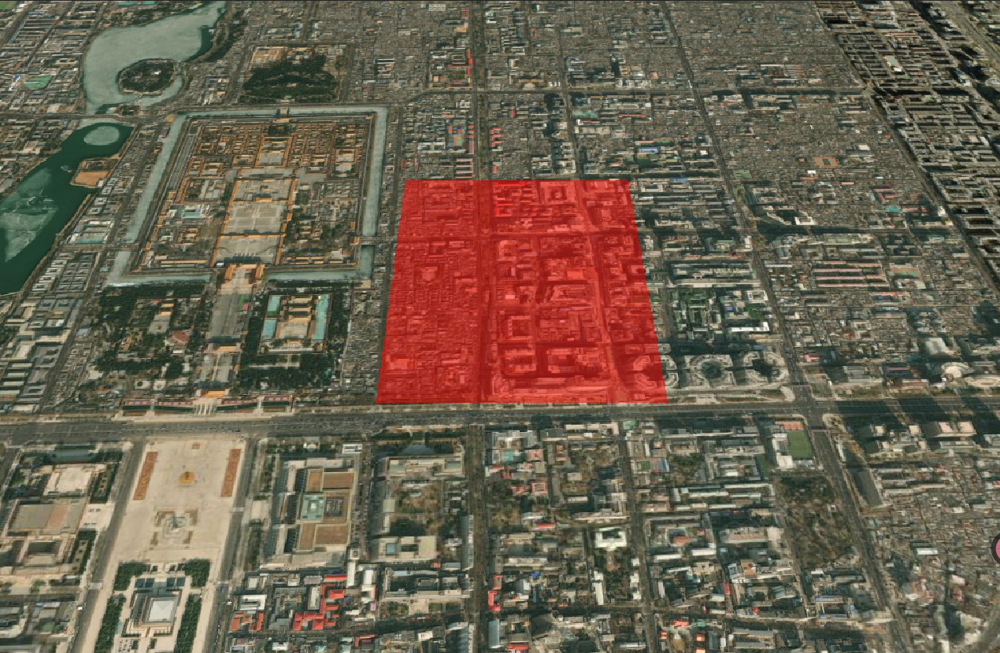

#### 带孔洞多边形实例

`hierarchy` 属性为 `PolygonHierarchy` 类型，该类型可以接受一个 Cartesian3 数组，也可以接受一个 PolygonHierarchy 数组，用于定义多边形的顶点位置和孔的位置。

```js
// 外部轮廓
const outerPositions = Cesium.Cartesian3.fromDegreesArray([
  116.39, 39.9, 116.41, 39.9, 116.41, 39.92, 116.39, 39.92,
]);

// 内部孔洞
const innerPositions = Cesium.Cartesian3.fromDegreesArray([
  116.397, 39.907, 116.403, 39.907, 116.403, 39.913, 116.397, 39.913,
]);

const polygon = viewer.entities.add({
  polygon: {
    hierarchy: new Cesium.PolygonHierarchy(outerPositions, [
      new Cesium.PolygonHierarchy(innerPositions),
    ]),
    material: Cesium.Color.RED.withAlpha(0.5),
    outline: true,
    outlineColor: Cesium.Color.WHITE,
    outlineWidth: 2,
    height: 100, // 从100米高度开始
    extrudedHeight: 300, // 拉伸至300米高度
  },
});
```

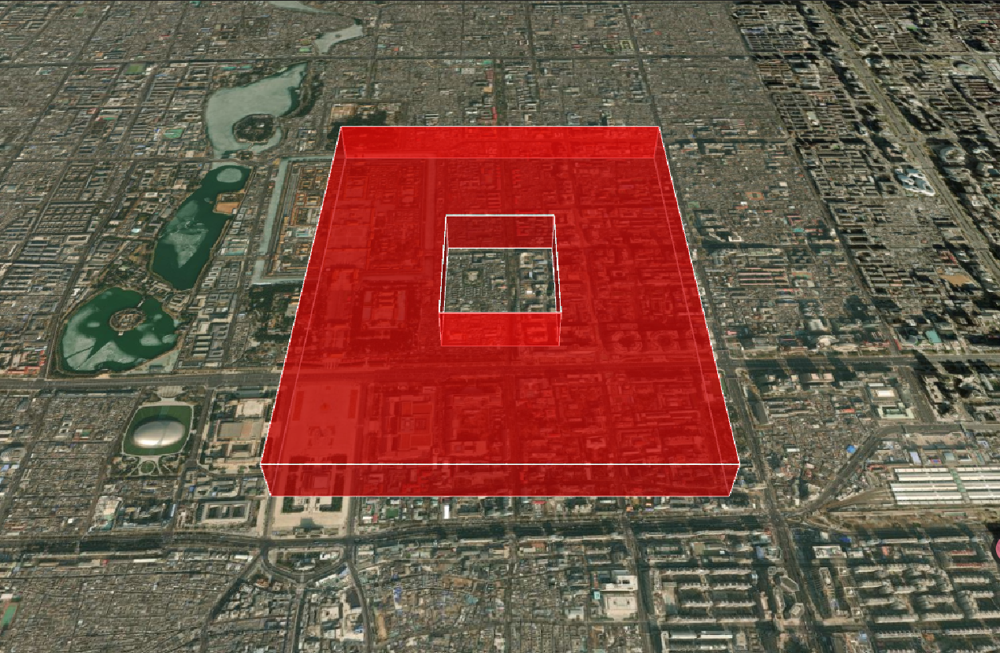

### 模型（Model）

模型实体用于加载和显示 3D 模型，支持 glTF/glb 格式，是实现复杂三维场景的关键技术。

> 注意:模型路径属性就是`uri`，不是`url`

| 属性                         | 类型            | 默认值      | 描述                                                                                               |
| ---------------------------- | --------------- | ----------- | -------------------------------------------------------------------------------------------------- |
| `uri`                        | String          | null        | 模型文件的 URL                                                                                     |
| `enableVerticalExaggeration` | Boolean         | true        | 是否启用垂直夸大                                                                                   |
| `minimumPixelSize`           | Number          | 128         | 模型的最小像素大小（用于避免模型在屏幕上过于小）                                                   |
| `maximumScale`               | Number          |             | 模型的最大缩放比例                                                                                 |
| `incrementallyLoadTextures`  | Boolean         | true        | 是否增量加载纹理                                                                                   |
| `scale`                      | Number          | 1.0         | 模型的缩放比例                                                                                     |
| `runAnimations`              | Boolean         | true        | 是否运行模型的动画                                                                                 |
| `clampAnimations`            | Boolean         | true        | 是否限制动画时间                                                                                   |
| `animation`                  | Animation       | null        | 模型的动画                                                                                         |
| `shadows`                    | ShadowMode      | DISABLED    | 指定模型是投射还是接收来自光源的阴影                                                               |
| `heightReference`            | HeightReference | NONE        | 高度参考模式：<br>• NONE - 绝对高度<br>• CLAMP_TO_GROUND - 贴地<br>• RELATIVE_TO_GROUND - 相对地面 |
| `silhouetteColor`            | Color           | Color.RED   | 模型轮廓的颜色                                                                                     |
| `silhouetteSize`             | Number          | 0.0         | 模型轮廓的大小（像素）                                                                             |
| `color`                      | Color           | Color.WHITE | 模型的颜色                                                                                         |
| `colorBlendMode`             | ColorBlendMode  | HIGHLIGHT   | 颜色混合模式：<br>• HIGHLIGHT - 高亮<br>• REPLACE - 替换<br>• MIX - 混合                           |
| `colorBlendAmount`           | Number          | 0.0         | 颜色混合的强度                                                                                     |
| `imageBasedLightingFactor`   | Cartesian2      |             | 基于图像的光照因子                                                                                 |
| `environmentMapOptions`      |                 | null        | 环境贴图选项                                                                                       |
| `lightColor`                 | Color           | Color.WHITE | 光照颜色                                                                                           |
| `distanceDisplayCondition`   |                 | null        | 基于距离的显隐控制                                                                                 |
| `nodeTransformations`        |                 | null        | 节点变换                                                                                           |
| `articulations`              | Articulations   | null        | 模型的关节（关节动画）                                                                             |
| `clippingPlanes`             |                 | null        | 裁剪平面集合                                                                                       |
| `customShader`               | CustomShader    | null        | 自定义着色器                                                                                       |

#### 基础实例

> 注意: `无法使用import引入glb数据`

1. 可以将模型放在 public 目录下,建一个 models 文件,使用`/models/Cesium_Air.glb`
2. 自定义模型路径,使用`new URL("./models/Cesium_Air.glb", import.meta.url).href`引入路径
3. 以下模型是我从 cesium 官网中下载的,放在了该开源项目上,路径`/src/Aassets/Basics/models`

```js
const modelEntity = viewer.entities.add({
  position: Cesium.Cartesian3.fromDegrees(116.397, 39.907, 100),
  model: {
    // uri: '/models/Cesium_Air.glb', // 模型在public目录下
    uri: new URL("./models/Cesium_Air.glb", import.meta.url).href,
    scale: 10.0,
    minimumPixelSize: 128, // 最小像素尺寸
    maximumScale: 20000, // 最大缩放比例
  },
});
```

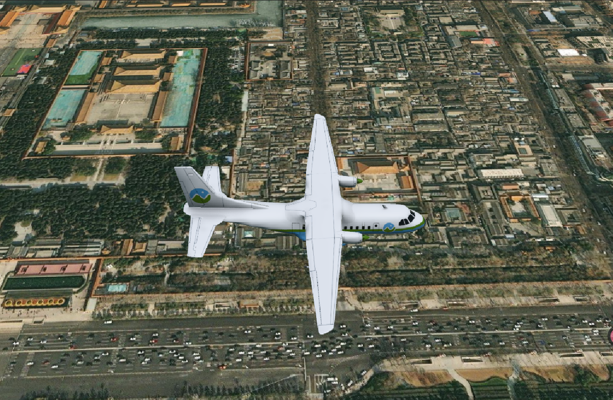

#### 动态位置 + 模型动画

- 如果模型有动画,可以通过将`viewer`的`shouldAnimate`属性设置为`true`来运行动画

```js
viewer = new Cesium.Viewer(cesiumContainer.value, {
  shouldAnimate: true, // 播放模型动画
});
```

- 使用`viewer.trackedEntity`属性可以将相机绑定到实体上,实现相机跟随实体移动
- 使用`viewFrom`设置一个合适的位置观察模型

:::details 展开代码

```vue
<template>
  <div ref="cesiumContainer" class="container"></div>
</template>

<script setup>
import { ref, onMounted } from "vue";
import * as Cesium from "cesium";
const cesiumContainer = ref(null);
let viewer = null;

// 天地图TOKEN
const token = "05be06461004055923091de7f3e51aa6";

onMounted(() => {
  // 初始化Viewer
  viewer = new Cesium.Viewer(cesiumContainer.value, {
    geocoder: false, // 关闭地理编码搜索
    homeButton: false, // 关闭主页按钮
    sceneModePicker: false, // 关闭场景模式选择器
    baseLayerPicker: false, // 关闭底图选择器
    navigationHelpButton: false, // 关闭导航帮助
    animation: false, // 关闭动画控件
    timeline: false, // 关闭时间轴
    fullscreenButton: false, // 关闭全屏按钮
    baseLayer: false, // 关闭默认地图
    shouldAnimate: true, // 设置模型动画
  });
  // 清空logo
  viewer.cesiumWidget.creditContainer.style.display = "none";
  initMap();

  const modelEntity = viewer.entities.add({
    position: Cesium.Cartesian3.fromDegrees(116.397, 39.907, 100),
    model: {
      // uri: '/models/Cesium_Air.glb', // 模型在public目录下
      uri: new URL("./models/Cesium_Air.glb", import.meta.url).href,
      scale: 10.0,
      minimumPixelSize: 128, // 最小像素尺寸
      maximumScale: 20000, // 最大缩放比例
    },
  });
  // 动态位置
  let t = 0.000001;
  modelEntity.position = new Cesium.CallbackProperty(() => {
    t += 0.000001;
    return Cesium.Cartesian3.fromDegrees(116.397 + t, 39.907, 100);
  }, false);

  // 相机跟随实体
  viewer.trackedEntity = modelEntity;
  // 相对于实体的本地坐标（X:右, Y:前, Z:上）
  modelEntity.viewFrom = new Cesium.Cartesian3(500, -180, 400);
});

// 加载天地图
const initMap = () => {
  // 以下为天地图及天地图标注加载
  const tiandituProvider = new Cesium.WebMapTileServiceImageryProvider({
    url:
      "http://{s}.tianditu.gov.cn/img_w/wmts?service=wmts&request=GetTile&version=1.0.0&LAYER=img&tileMatrixSet=w&TileMatrix={TileMatrix}&TileRow={TileRow}&TileCol={TileCol}&style=default&format=tiles&tk=" +
      token,
    layer: "img",
    style: "default",
    format: "tiles",
    tileMatrixSetID: "w",
    subdomains: ["t0", "t1", "t2", "t3", "t4", "t5", "t6", "t7"], // 子域名
    maximumLevel: 18,
    credit: new Cesium.Credit("天地图影像"),
  });
  // 天地图影像添加到viewer实例的影像图层集合中
  viewer.imageryLayers.addImageryProvider(tiandituProvider);
};
</script>
<style scoped>
.container {
  width: 100vw;
  height: 100vh;
}
</style>
```

:::

<video controls width="600">
  <source src="./imgs/08_模型动画.mp4" type="video/mp4" />
  您的浏览器不支持HTML5视频标签。
</video>

#### 模型裁剪

```js
// 创建裁剪平面（垂直于X轴）
const clippingPlane = new Cesium.ClippingPlane(
  new Cesium.Cartesian3(1, 0, 0), // 法线方向
  0 // 距离原点的距离
);

modelEntity.model.clippingPlanes = new Cesium.ClippingPlaneCollection({
  planes: [clippingPlane],
  edgeWidth: 1.0, // 裁剪边缘宽度
  edgeColor: Cesium.Color.RED, // 裁剪边缘颜色
});
```

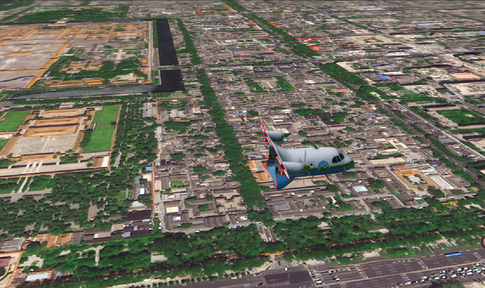

### 广告牌（Billboard）

广告牌实体用于在 3D 场景中显示 2D 图像，始终面向相机，适合标记位置或显示图标。

| 属性                       | 类型             | 默认值                  | 描述                                                                                                       |
| -------------------------- | ---------------- | ----------------------- | ---------------------------------------------------------------------------------------------------------- |
| `image`                    | String           | null                    | 广告牌的图像 URL                                                                                           |
| `scale`                    | Number           | 1.0                     | 广告牌的缩放比例                                                                                           |
| `color`                    | Color            | Color.WHITE             | 广告牌的颜色                                                                                               |
| `width`                    | Number           | 0.0                     | 广告牌的宽度（像素）                                                                                       |
| `height`                   | Number           | 0.0                     | 广告牌的高度（像素）                                                                                       |
| `verticalOrigin`           | VerticalOrigin   | CENTER                  | 广告牌的垂直对齐方式：<br>• CENTER - 居中对齐<br>• BOTTOM - 底部对齐<br>• TOP - 顶部对齐                   |
| `horizontalOrigin`         | HorizontalOrigin | CENTER                  | 广告牌的水平对齐方式：<br>• CENTER - 居中对齐<br>• LEFT - 左对齐<br>• RIGHT - 右对齐                       |
| `pixelOffset`              | Cartesian2       | new Cartesian2(0, 0)    | 广告牌相对于其位置的像素偏移量                                                                             |
| `eyeOffset`                | Cartesian3       | new Cartesian3(0, 0, 0) | 广告牌相对于相机的偏移量                                                                                   |
| `rotation`                 | Number           | 0.0                     | 绕 alignedAxis 的旋转                                                                                      |
| `alignedAxis`              | Cartesian3       | new Cartesian3(0, 0, 1) | 指定旋转的单位向量轴                                                                                       |
| `sizeInMeters`             | Boolean          | false                   | 是否以米为单位指定广告牌的大小                                                                             |
| `heightReference`          | HeightReference  | NONE                    | 广告牌的高度参考模式：<br>• NONE - 绝对高度<br>• CLAMP_TO_GROUND - 贴地<br>• RELATIVE_TO_GROUND - 相对地面 |
| `scaleByDistance`          | NearFarScalar    | null                    | 根据相机距离缩放广告牌大小                                                                                 |
| `translucencyByDistance`   | NearFarScalar    | null                    | 根据相机距离调整透明度                                                                                     |
| `distanceDisplayCondition` |                  | null                    | 基于距离的显隐控制                                                                                         |
| `disableDepthTestDistance` | Number           | null                    | 用于指定要禁用深度测试的相机的距离                                                                         |

#### 基础实例

```js
const billboard = viewer.entities.add({
  position: Cesium.Cartesian3.fromDegrees(116.3975, 39.9075),
  billboard: {
    image: "/images/marker.png", // 图标路径
    scale: 0.5,
    color: Cesium.Color.WHITE,
    horizontalOrigin: Cesium.HorizontalOrigin.CENTER,
    verticalOrigin: Cesium.VerticalOrigin.BOTTOM,
    // pixelOffset: new Cesium.Cartesian2(0, -20), // 向上偏移20像素
  },
});
billboard.billboard.pixelOffset = new Cesium.Cartesian2(0, -50); // 向下偏移 50 像素
```

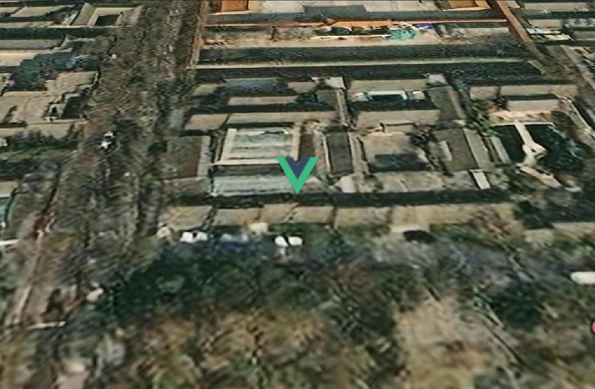

### 箱（Box）

箱（Box）是 Cesium 中用于表示三维矩形的核心元素。它可以用于创建 3D 模型、表示物体的边界框、可视化数据等。

| 属性                       | 类型             | 默认值                  | 描述                                                                                               |
| -------------------------- | ---------------- | ----------------------- | -------------------------------------------------------------------------------------------------- |
| `dimensions`               | Cartesian3       | new Cartesian3(1, 1, 1) | 箱的尺寸（x, y, z）                                                                                |
| `heightReference`          | HeightReference  | NONE                    | 高度参考模式：<br>• NONE - 绝对高度<br>• CLAMP_TO_GROUND - 贴地<br>• RELATIVE_TO_GROUND - 相对地面 |
| `material`                 | MaterialProperty | Color.WHITE             | 箱的材质（颜色、纹理、特效等）                                                                     |
| `outline`                  | Boolean          | false                   | 是否显示轮廓                                                                                       |
| `outlineColor`             | Color            | Color.BLACK             | 轮廓的颜色                                                                                         |
| `outlineWidth`             | Number           | 1.0                     | 轮廓的宽度（像素）                                                                                 |
| `fill`                     | Boolean          | true                    | 是否填充箱                                                                                         |
| `shadows`                  | ShadowMode       | DISABLED                | 指定箱是投射还是接收来自光源的阴影                                                                 |
| `distanceDisplayCondition` |                  | null                    | 基于距离的显隐控制                                                                                 |

#### 基础实例

```js
const box = viewer.entities.add({
  position: Cesium.Cartesian3.fromDegrees(116.3975, 39.9075, 50),
  box: {
    dimensions: new Cesium.Cartesian3(1000, 1000, 500), // 长、宽、高
    material: Cesium.Color.RED.withAlpha(0.5), // 半透明红色
    outline: true,
    outlineColor: Cesium.Color.WHITE,
    outlineWidth: 2,
    heightReference: Cesium.HeightReference.CLAMP_TO_GROUND, // 贴地显示
  },
});
```

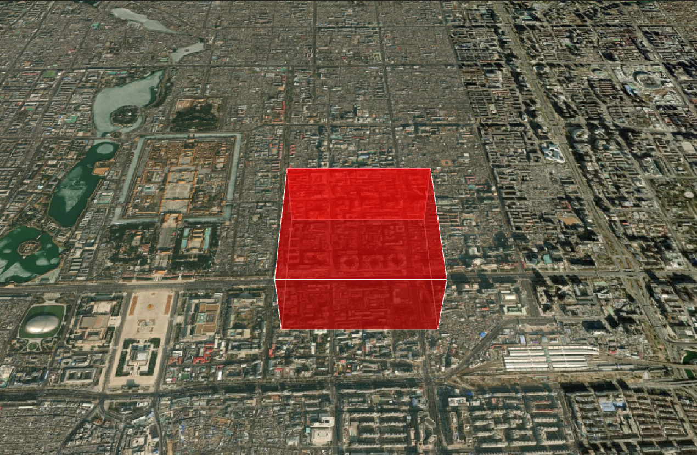

### 矩形（Rectangle）

| 属性                       | 类型             | 默认值                    | 描述                                                                                               |
| -------------------------- | ---------------- | ------------------------- | -------------------------------------------------------------------------------------------------- |
| `coordinates`              | Rectangle        | new Rectangle(0, 0, 1, 1) | 矩形的坐标（west, south, east, north）                                                             |
| `height`                   | Number           | 0.0                       | 矩形的高度（相对于地形）                                                                           |
| `heightReference`          | HeightReference  | NONE                      | 高度参考模式：<br>• NONE - 绝对高度<br>• CLAMP_TO_GROUND - 贴地<br>• RELATIVE_TO_GROUND - 相对地面 |
| `material`                 | MaterialProperty | Color.WHITE               | 矩形的材质（颜色、纹理、特效等）                                                                   |
| `outline`                  | Boolean          | false                     | 是否显示轮廓                                                                                       |
| `outlineColor`             | Color            | Color.BLACK               | 轮廓的颜色                                                                                         |
| `outlineWidth`             | Number           | 1.0                       | 轮廓的宽度（像素）                                                                                 |
| `fill`                     | Boolean          | true                      | 是否填充矩形                                                                                       |
| `rotation`                 | Number           | 0.0                       | 矩形的旋转角度（弧度）                                                                             |
| `stRotation`               | Number           | 0.0                       | 纹理旋转角度（弧度）                                                                               |
| `extrudedHeight`           | Number           | 0.0                       | 矩形的拉伸高度（相对于地形）                                                                       |
| `shadows`                  | ShadowMode       | DISABLED                  | 指定矩形是投射还是接收来自光源的阴影                                                               |
| `distanceDisplayCondition` |                  | null                      | 基于距离的显隐控制                                                                                 |

#### 基础实例

```js
const rectangle = viewer.entities.add({
  position: Cesium.Cartesian3.fromDegrees(116.3975, 39.9075, 50),
  rectangle: {
    coordinates: Cesium.Rectangle.fromDegrees(
      116.3975,
      39.9075,
      116.4075,
      39.9175
    ), // 矩形的坐标
    material: Cesium.Color.GREEN.withAlpha(0.5), // 半透明绿色
    outline: true,
    outlineColor: Cesium.Color.WHITE,
    outlineWidth: 2,
    height: 100, // 矩形的高度
    extrudedHeight: 200, // 矩形的拉伸高度
    heightReference: Cesium.HeightReference.CLAMP_TO_GROUND, // 贴地显示
  },
});
```

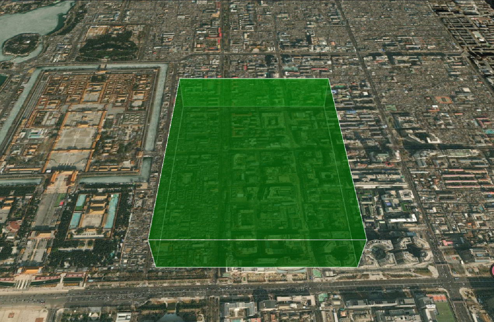

### 椭圆（Ellipse）

| 属性                       | 类型             | 默认值      | 描述                                                                                               |
| -------------------------- | ---------------- | ----------- | -------------------------------------------------------------------------------------------------- |
| `semiMajorAxis`            | Number           | 1.0         | 椭圆的长半轴长度                                                                                   |
| `semiMinorAxis`            | Number           | 1.0         | 椭圆的短半轴长度                                                                                   |
| `height`                   | Number           | 0.0         | 椭圆的高度（相对于地形）                                                                           |
| `heightReference`          | HeightReference  | NONE        | 高度参考模式：<br>• NONE - 绝对高度<br>• CLAMP_TO_GROUND - 贴地<br>• RELATIVE_TO_GROUND - 相对地面 |
| `material`                 | MaterialProperty | Color.WHITE | 椭圆的材质（颜色、纹理、特效等）                                                                   |
| `granularity`              | Number           |             | 椭圆的粒度（用于简化椭圆）                                                                         |
| `outline`                  | Boolean          | false       | 是否显示轮廓                                                                                       |
| `outlineColor`             | Color            | Color.BLACK | 轮廓的颜色                                                                                         |
| `outlineWidth`             | Number           | 1.0         | 轮廓的宽度（像素）                                                                                 |
| `fill`                     | Boolean          | true        | 是否填充椭圆                                                                                       |
| `rotation`                 | Number           | 0.0         | 椭圆的旋转角度（弧度）                                                                             |
| `stRotation`               | Number           | 0.0         | 纹理旋转角度（弧度）                                                                               |
| `extrudedHeight`           | Number           | 0.0         | 椭圆的拉伸高度（相对于地形）                                                                       |
| `shadows`                  | ShadowMode       | DISABLED    | 指定椭圆是投射还是接收来自光源的阴影                                                               |
| `distanceDisplayCondition` |                  | null        | 基于距离的显隐控制                                                                                 |

#### 基础实例

```js
const ellipse = viewer.entities.add({
  position: Cesium.Cartesian3.fromDegrees(116.3975, 39.9075, 50),
  ellipse: {
    semiMajorAxis: 1000, // 长半轴
    semiMinorAxis: 500, // 短半轴
    material: Cesium.Color.BLUE.withAlpha(0.5), // 半透明蓝色
    outline: true,
    outlineColor: Cesium.Color.WHITE,
    outlineWidth: 2,
    height: 100, // 椭圆的高度
    extrudedHeight: 200, // 椭圆的拉伸高度
    heightReference: Cesium.HeightReference.CLAMP_TO_GROUND, // 贴地显示
  },
});
```

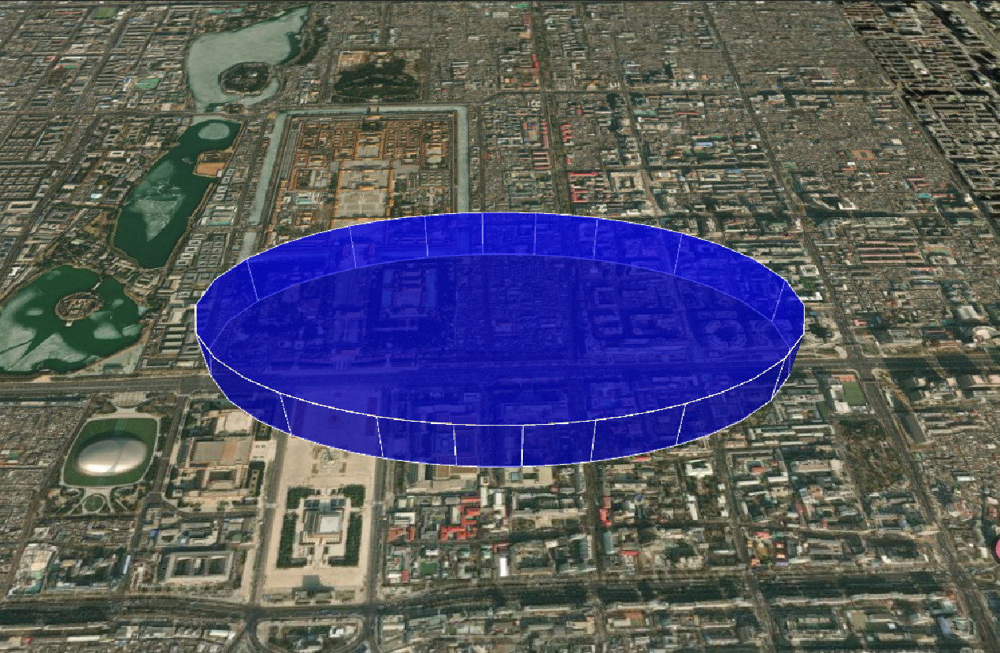

### 椭圆体（Ellipsoid）

| 属性                       | 类型             | 默认值         | 描述                                                                                               |
| -------------------------- | ---------------- | -------------- | -------------------------------------------------------------------------------------------------- |
| `radii`                    | Cartesian3       | null           | 椭圆体的半径（x, y, z）                                                                            |
| `innerRadii`               | Cartesian3       | null           | 椭圆体的内半径（x, y, z）                                                                          |
| `minimumClock`             | Number           | 0.0            | 椭圆体的最小时钟角度（弧度）                                                                       |
| `maximumClock`             | Number           | 2.0 \* Math.PI | 椭圆体的最大时钟角度（弧度）                                                                       |
| `minimumCone`              | Number           | 0.0            | 椭圆体的最小圆锥角度（弧度）                                                                       |
| `maximumCone`              | Number           | Math.PI        | 椭圆体的最大圆锥角度（弧度）                                                                       |
| `heightReference`          | HeightReference  | NONE           | 高度参考模式：<br>• NONE - 绝对高度<br>• CLAMP_TO_GROUND - 贴地<br>• RELATIVE_TO_GROUND - 相对地面 |
| `material`                 | MaterialProperty | Color.WHITE    | 椭圆体的材质（颜色、纹理、特效等）                                                                 |
| `outline`                  | Boolean          | false          | 是否显示轮廓                                                                                       |
| `outlineColor`             | Color            | Color.BLACK    | 轮廓的颜色                                                                                         |
| `outlineWidth`             | Number           | 1.0            | 轮廓的宽度（像素）                                                                                 |
| `fill`                     | Boolean          | true           | 是否填充椭圆体                                                                                     |
| `shadows`                  | ShadowMode       | DISABLED       | 指定椭圆体是投射还是接收来自光源的阴影                                                             |
| `distanceDisplayCondition` |                  | null           | 基于距离的显隐控制                                                                                 |
| `stackPartitions`          | Number           | 64             | 堆叠分区数                                                                                         |
| `slicePartitions`          | Number           | 64             | 切片分区数                                                                                         |
| `subdivisions`             | Number           | 128            | 细分次数                                                                                           |

#### 基础实例

```js
const ellipsoid = viewer.entities.add({
  position: Cesium.Cartesian3.fromDegrees(116.3975, 39.9075, 50),
  ellipsoid: {
    radii: new Cesium.Cartesian3(1000, 500, 250), // 长半轴、短半轴、高半轴
    material: Cesium.Color.YELLOW.withAlpha(0.5), // 半透明黄色
    outline: true,
    outlineColor: Cesium.Color.WHITE,
    outlineWidth: 2,
    extrudedHeight: 200, // 椭圆体的拉伸高度
    heightReference: Cesium.HeightReference.CLAMP_TO_GROUND, // 贴地显示
  },
});
```

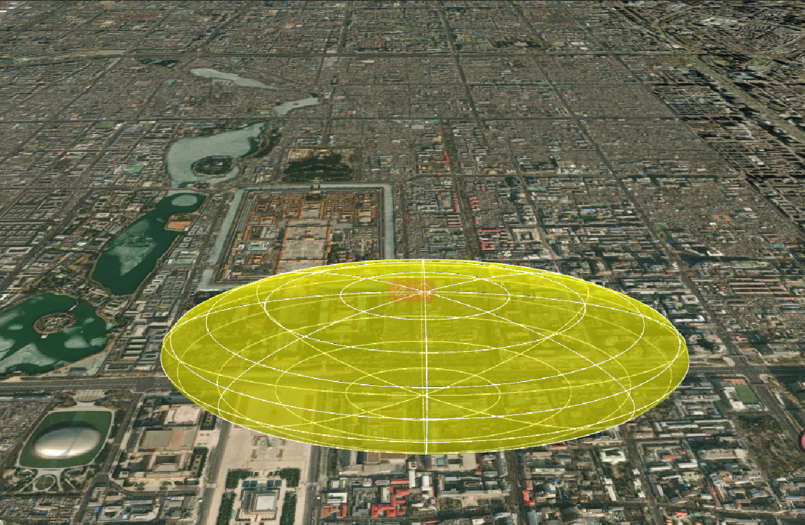

### 圆柱体（Cylinder）

| 属性                       | 类型             | 默认值      | 描述                                                                                               |
| -------------------------- | ---------------- | ----------- | -------------------------------------------------------------------------------------------------- |
| `length`                   | Number           |             | 圆柱体的长度                                                                                       |
| `topRadius`                | Number           |             | 圆柱体顶部的半径                                                                                   |
| `bottomRadius`             | Number           |             | 圆柱体底部的半径                                                                                   |
| `heightReference`          | HeightReference  | NONE        | 高度参考模式：<br>• NONE - 绝对高度<br>• CLAMP_TO_GROUND - 贴地<br>• RELATIVE_TO_GROUND - 相对地面 |
| `material`                 | MaterialProperty | Color.WHITE | 圆柱体的材质（颜色、纹理、特效等）                                                                 |
| `outline`                  | Boolean          | false       | 是否显示轮廓                                                                                       |
| `outlineColor`             | Color            | Color.BLACK | 轮廓的颜色                                                                                         |
| `outlineWidth`             | Number           | 1.0         | 轮廓的宽度（像素）                                                                                 |
| `fill`                     | Boolean          | true        | 是否填充圆柱体                                                                                     |
| `shadows`                  | ShadowMode       | DISABLED    | 指定圆柱体是投射还是接收来自光源的阴影                                                             |
| `distanceDisplayCondition` |                  | null        | 基于距离的显隐控制                                                                                 |
| `numberOfVerticalLines`    | Number           | 16          | 垂直线条数                                                                                         |
| `slices`                   | Number           | 128         | 切片数                                                                                             |

#### 基础实例

```js
const cylinder = viewer.entities.add({
  position: Cesium.Cartesian3.fromDegrees(116.3975, 39.9075, 50),
  cylinder: {
    length: 1000, // 圆柱体的长度
    topRadius: 500, // 顶部半径
    bottomRadius: 500, // 底部半径
    material: Cesium.Color.PURPLE.withAlpha(0.5), // 半透明紫色
    extrudedHeight: 200, // 圆柱体的拉伸高度
  },
});
```

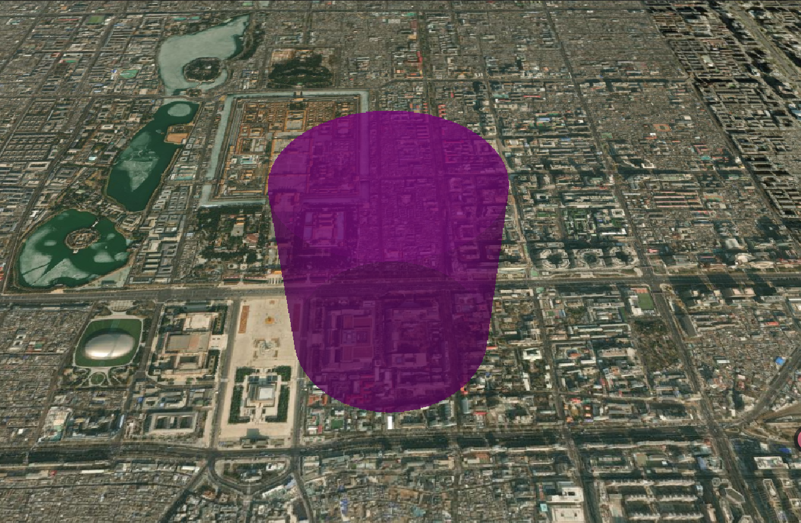

### 标签（Label）

| 属性                         | 类型             | 默认值                  | 描述                                                                                               |
| ---------------------------- | ---------------- | ----------------------- | -------------------------------------------------------------------------------------------------- |
| `text`                       | String           |                         | 标签的文本内容                                                                                     |
| `font`                       | String           | '30px sans-serif'       | 标签的字体                                                                                         |
| `style`                      | TextStyle        | LabelStyle.FILL         | 标签的样式                                                                                         |
| `fillColor`                  | Color            | Color.WHITE             | 标签的填充颜色                                                                                     |
| `outlineColor`               | Color            | Color.BLACK             | 标签的轮廓颜色                                                                                     |
| `outlineWidth`               | Number           | 1.0                     | 标签的轮廓宽度                                                                                     |
| `scale`                      | Number           | 1.0                     | 标签的缩放比例                                                                                     |
| `showBackground`             | Boolean          | false                   | 是否显示背景                                                                                       |
| `backgroundColor`            | Color            | Color.TRANSPARENT       | 背景颜色                                                                                           |
| `backgroundPadding`          | Cartesian2       | new Cartesian2(7, 5)    | 背景填充                                                                                           |
| `heightReference`            | HeightReference  | NONE                    | 高度参考模式：<br>• NONE - 绝对高度<br>• CLAMP_TO_GROUND - 贴地<br>• RELATIVE_TO_GROUND - 相对地面 |
| `horizontalOrigin`           | HorizontalOrigin | CENTER                  | 标签的水平对齐方式：<br>• CENTER - 居中对齐<br>• LEFT - 左对齐<br>• RIGHT - 右对齐                 |
| `verticalOrigin`             | VerticalOrigin   | CENTER                  | 标签的垂直对齐方式：<br>• CENTER - 居中对齐<br>• BOTTOM - 底部对齐<br>• TOP - 顶部对齐             |
| `pixelOffset`                | Cartesian2       | new Cartesian2(0, 0)    | 标签相对于其位置的像素偏移量                                                                       |
| `eyeOffset`                  | Cartesian3       | new Cartesian3(0, 0, 0) | 标签相对于相机的偏移量                                                                             |
| `pixelOffsetScaleByDistance` | NearFarScalar    |                         | 根据相机距离缩放像素偏移量                                                                         |
| `scaleByDistance`            | NearFarScalar    |                         | 根据相机距离缩放标签大小                                                                           |
| `translucencyByDistance`     | NearFarScalar    |                         | 根据相机距离调整透明度                                                                             |
| `distanceDisplayCondition`   |                  |                         | 基于距离的显隐控制                                                                                 |
| `disableDepthTestDistance`   | Number           |                         | 用于指定要禁用深度测试的相机的距离                                                                 |

#### 基础实例

```js
const label = viewer.entities.add({
  position: Cesium.Cartesian3.fromDegrees(116.3975, 39.9075, 50),
  label: {
    text: "Hello World", // 标签文本
    font: "30px sans-serif", // 字体
    style: Cesium.LabelStyle.FILL, // 样式
    fillColor: Cesium.Color.WHITE, // 填充颜色
    outlineColor: Cesium.Color.BLACK, // 轮廓颜色
    outlineWidth: 2, // 轮廓宽度
    scale: 1.0, // 缩放比例
    showBackground: true, // 显示背景
    backgroundColor: Cesium.Color.TRANSPARENT, // 背景颜色
    backgroundPadding: new Cesium.Cartesian2(7, 5), // 背景填充
    heightReference: Cesium.HeightReference.CLAMP_TO_GROUND, // 贴地显示
    horizontalOrigin: Cesium.HorizontalOrigin.CENTER, // 水平对齐方式
    verticalOrigin: Cesium.VerticalOrigin.BOTTOM, // 垂直对齐方式
    pixelOffset: new Cesium.Cartesian2(0, -50), // 向下偏移 50 像素
    eyeOffset: new Cesium.Cartesian3(0, 0, 0), // 相对于相机的偏移量
  },
});
```

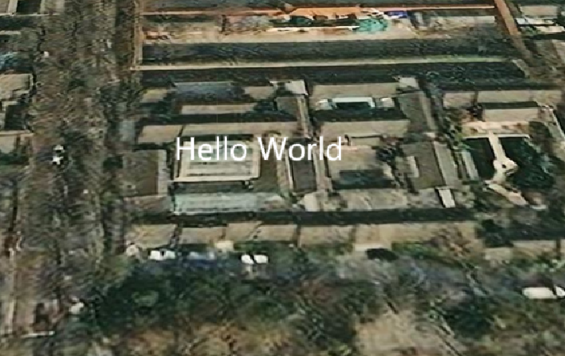

### 墙（Wall）

| 属性                       | 类型             | 默认值             | 描述                               |
| -------------------------- | ---------------- | ------------------ | ---------------------------------- |
| `positions`                | Cartesian3[]     |                    | 墙的顶点位置数组                   |
| `maximumHeights`           | Number[]         |                    | 墙的最大高度数组                   |
| `minimumHeights`           | Number[]         |                    | 墙的最小高度数组                   |
| `material`                 | MaterialProperty | Color.WHITE        | 墙的材质（颜色、纹理、特效等）     |
| `outline`                  | Boolean          | false              | 是否显示轮廓                       |
| `outlineColor`             | Color            | Color.BLACK        | 轮廓的颜色                         |
| `outlineWidth`             | Number           | 1.0                | 轮廓的宽度（像素）                 |
| `fill`                     | Boolean          | true               | 是否填充墙                         |
| `shadows`                  | ShadowMode       | DISABLED           | 指定墙是投射还是接收来自光源的阴影 |
| `distanceDisplayCondition` |                  |                    | 基于距离的显隐控制                 |
| `granularity`              | Number           | RADIANS_PER_DEGREE | 墙的粒度（用于简化墙）             |

#### 基础实例

```js
const wall = viewer.entities.add({
  wall: {
    positions: Cesium.Cartesian3.fromDegreesArrayHeights([
      116.3975, 39.9075, 100, 116.4075, 39.9075, 100, 116.4075, 39.9175, 100,
      116.3975, 39.9175, 100, 116.3975, 39.9075, 100,
    ]),
    material: Cesium.Color.GREEN.withAlpha(0.5), // 半透明绿色
    outline: true,
    outlineColor: Cesium.Color.WHITE,
    outlineWidth: 2,
    maximumHeights: [100, 100, 200, 100, 100], // 每个顶点的最大高度
    minimumHeights: [0, 0, 0, 0, 0], // 每个顶点的最小高度
  },
});
```


### 走廊（Corridor）

| 属性                       | 类型             | 默认值      | 描述                                                                                                   |
| -------------------------- | ---------------- | ----------- | ------------------------------------------------------------------------------------------------------ |
| `positions`                | Cartesian3[]     |             | 走廊的顶点位置数组                                                                                     |
| `width`                    | Number           |             | 走廊的宽度                                                                                             |
| `height`                   | Number           |             | 走廊的高度（相对于地形）                                                                               |
| `heightReference`          | HeightReference  | NONE        | 高度参考模式：<br>• NONE - 绝对高度<br>• CLAMP_TO_GROUND - 贴地<br>• RELATIVE_TO_GROUND - 相对地面     |
| `extrudedHeight`           | Number           |             | 走廊的拉伸高度（相对于地形）                                                                           |
| `extrudedHeightReference`  | HeightReference  | NONE        | 拉伸高度参考模式：<br>• NONE - 绝对高度<br>• CLAMP_TO_GROUND - 贴地<br>• RELATIVE_TO_GROUND - 相对地面 |
| `cornerType`               | CornerType       | ROUNDED     | 走廊的拐角类型：<br>• ROUNDED - 圆角<br>• MITERED - 尖角                                               |
| `granularity`              | Number           |             | 走廊的粒度（用于简化走廊）                                                                             |
| `material`                 | MaterialProperty | Color.WHITE | 走廊的材质（颜色、纹理、特效等）                                                                       |
| `fill`                     | Boolean          | true        | 是否填充走廊                                                                                           |
| `outline`                  | Boolean          | false       | 是否显示轮廓                                                                                           |
| `outlineColor`             | Color            | Color.BLACK | 轮廓的颜色                                                                                             |
| `outlineWidth`             | Number           | 1.0         | 轮廓的宽度（像素）                                                                                     |
| `shadows`                  | ShadowMode       | DISABLED    | 指定走廊是投射还是接收来自光源的阴影                                                                   |
| `distanceDisplayCondition` |                  |             | 基于距离的显隐控制                                                                                     |

#### 基础实例

```js
const corridor = viewer.entities.add({
  corridor: {
    positions: Cesium.Cartesian3.fromDegreesArrayHeights([
      116.3975, 39.9075, 100, 116.4075, 39.9075, 100, 116.4075, 39.9175, 100,
    ]),
    width: 100, // 走廊宽度
    height: 50, // 走廊高度
    material: Cesium.Color.ORANGE.withAlpha(0.5), // 半透明橙色
    extrudedHeight: 20, // 走廊拉伸高度
    outline: true,
    outlineColor: Cesium.Color.WHITE,
    outlineWidth: 2,
  },
});
```

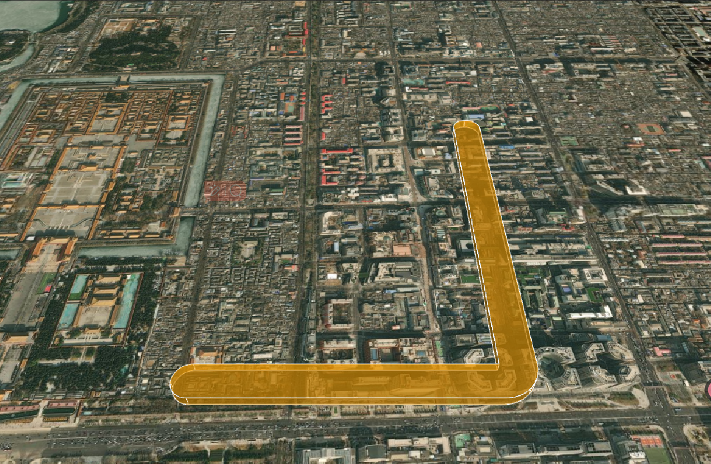

### 路径（Path）

| 属性                       | 类型             | 默认值      | 描述                             |
| -------------------------- | ---------------- | ----------- | -------------------------------- |
| `width`                    | Number           | 1.0         | 路径的宽度                       |
| `resolution`               | Number           | 60          | 路径的分辨率                     |
| `material`                 | MaterialProperty | Color.WHITE | 路径的材质（颜色、纹理、特效等） |
| `leadTime`                 | Number           |             | 路径的前导时间                   |
| `trailTime`                | Number           |             | 路径的后拖时间                   |
| `distanceDisplayCondition` |                  |             | 基于距离的显隐控制               |

## 实体生命周期

```js
// 创建实体
const entity = viewer.entities.add({
  id: "unique-id", // 建议显式指定唯一ID
  position: Cesium.Cartesian3.fromDegrees(116.3975, 39.9075),
  point: { pixelSize: 10, color: Cesium.Color.RED },
});

// 更新实体
entity.position = Cesium.Cartesian3.fromDegrees(116.4075, 39.9075);
entity.point.color = Cesium.Color.BLUE;

// 查询实体
const foundEntity = viewer.entities.getById("unique-id");

// 删除实体
viewer.entities.remove(entity);
// 批量删除
viewer.entities.removeAll();
```

## 性能优化建议

### 1. 实体数量控制

- 当实体数量超过 1000 时，考虑使用`BillboardCollection`和`Primitive`等底层 API
- 利用`DataSource`的`clustering`功能聚合大量实体：

```js
dataSource.clustering.enabled = true;
dataSource.clustering.pixelRange = 40; // 聚合像素范围
dataSource.clustering.minimumClusterSize = 5; // 最小聚合数量
```

### 2. 属性优化

- 避免使用`CallbackProperty`（尤其是高频更新的），优先使用`SampledProperty`
- 对于静态属性，直接赋值而非使用属性对象：

  ```js
  // 推荐
  entity.point.pixelSize = 10;

  // 不推荐（除非需要动态变化）
  entity.point.pixelSize = new Cesium.ConstantProperty(10);
  ```

### 3. 内存管理

- 及时移除不再需要的实体：

  ```js
  // 移除单个实体
  viewer.entities.remove(entity);

  // 移除所有实体
  viewer.entities.removeAll();

  // 移除数据源中的实体
  dataSource.entities.removeAll();
  ```

- 对于临时效果（如粒子系统），设置`lifetime`自动销毁

### 4. 渲染优化

- 合理设置`distanceDisplayCondition`控制远距离实体的显示：

  ```js
  entity.distanceDisplayCondition = new Cesium.DistanceDisplayCondition(
    100, // 最小可见距离（米）
    5000 // 最大可见距离（米）
  );
  ```

- 使用`disableDepthTestDistance`解决标签遮挡问题：

  ```js
  entity.label.disableDepthTestDistance = Number.POSITIVE_INFINITY;
  ```
