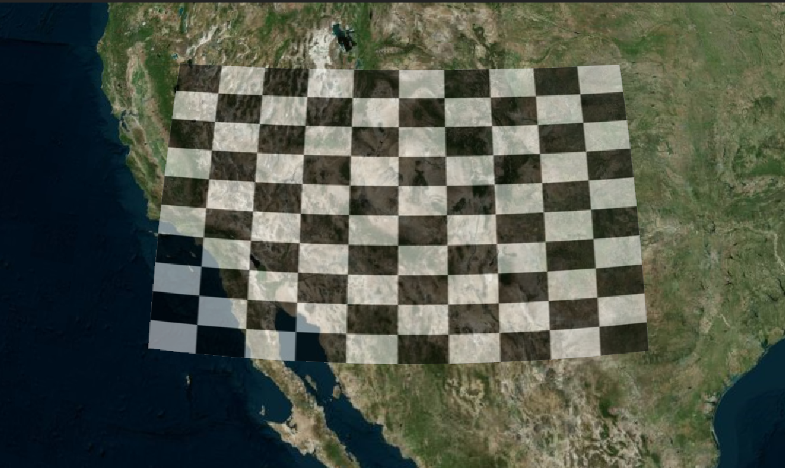
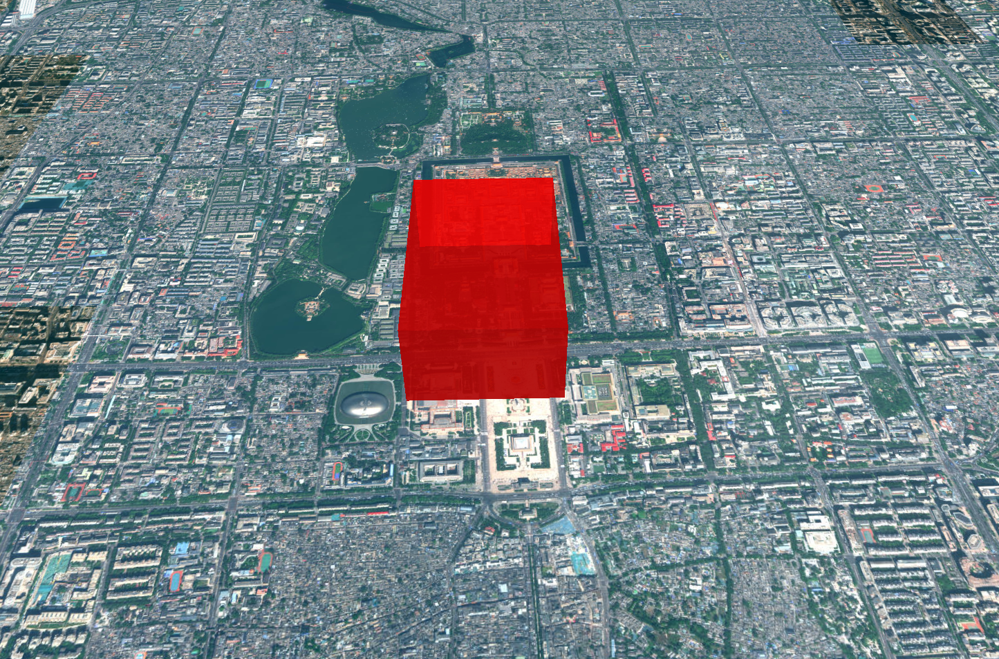
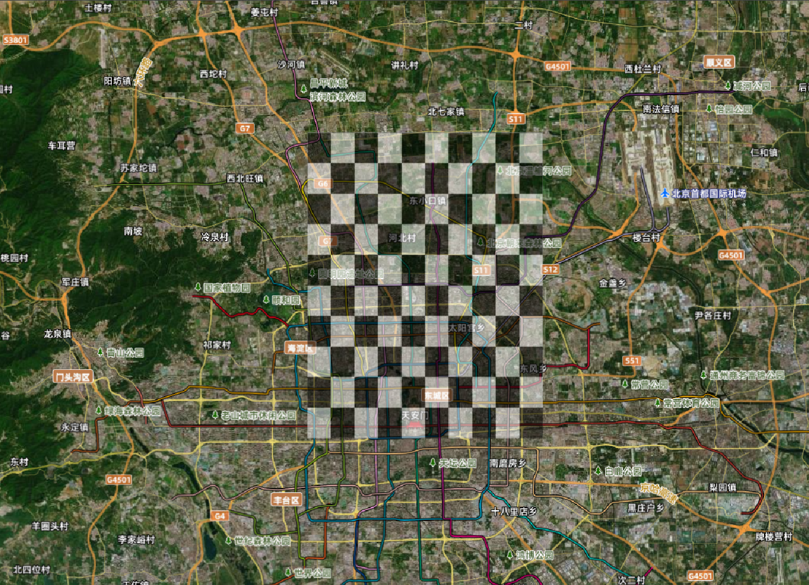
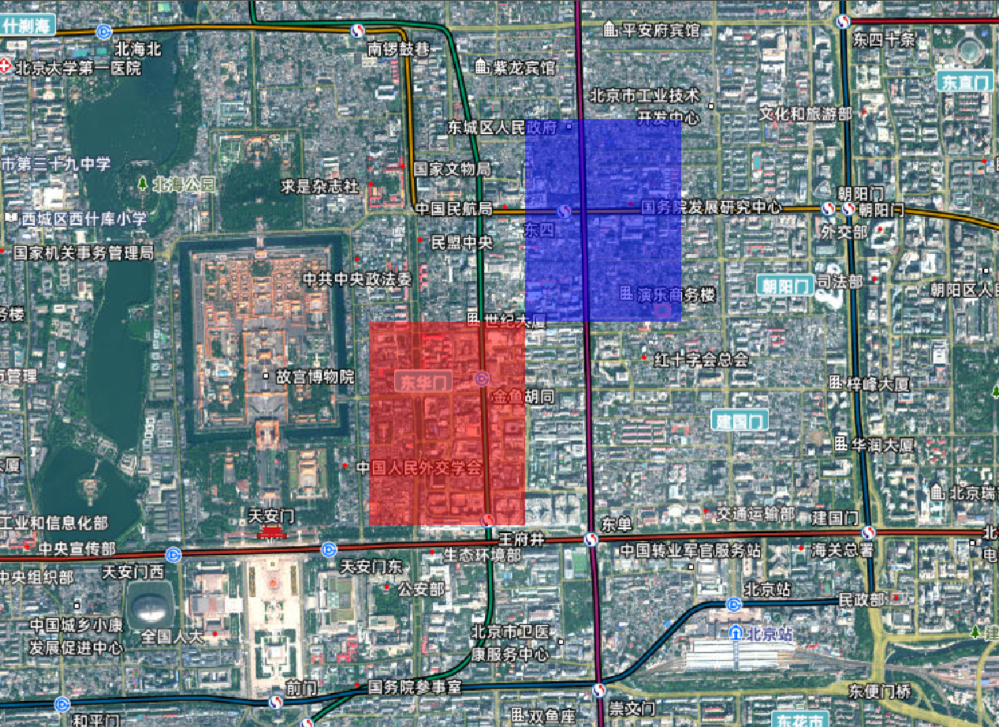
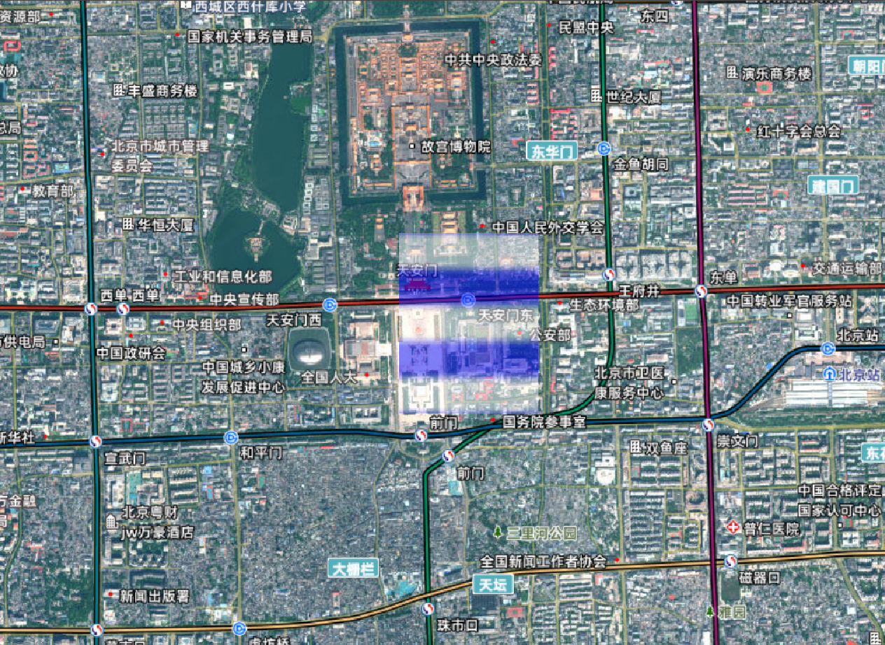
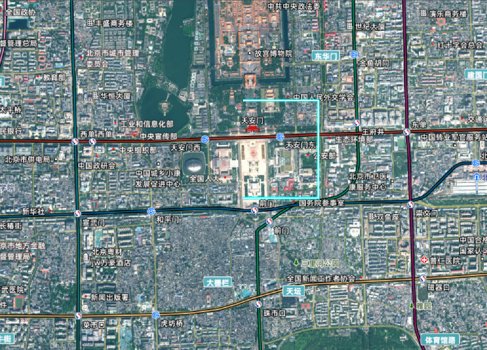

# Cesium Primitive（图元）系统深度解析

## Primitive 核心概念

Primitive 是 Cesium 中直接操作 WebGL 渲染管线的底层 API，采用**数据与渲染分离**的设计模式，将几何数据(Geometry)与渲染样式(Appearance)解耦，实现高效渲染与灵活样式控制的平衡。

**核心优势**：

- **渲染效率**：支持批处理渲染，大幅减少 WebGL 绘制调用
- **硬件加速**：直接利用 GPU 特性（实例化、顶点缓冲对象）
- **精细控制**：完全掌控渲染状态、着色器和顶点数据
- **内存优化**：支持顶点压缩和几何数据复用


### 与 Entity 的核心区别

> Entity 是基于 Primitive 的封装, 提供了更高级的 API, 更易用, 但`性能不如 Primitive`

| 特性         | Primitive                    | Entity                         |
| ------------ | ---------------------------- | ------------------------------ |
| **抽象层级** | 底层（接近 WebGL）           | 高层（声明式 API）             |
| **数据流向** | 开发者 →WebGL                | 开发者 →Entity→Primitive→WebGL |
| **内存占用** | 低（直接管理）               | 中（额外封装开销）             |
| **适用规模** | 大规模静态数据（10 万+对象） | 中小规模动态对象（1 万以下）   |
| **绘制调用** | 可合并（同外观实例）         | 独立绘制（每个实体）           |

## 配置项

```js
new Cesium.Primitive(options);
```

| 配置项                          | 描述                                                   |
| ------------------------------- | ------------------------------------------------------ |
| `geometryInstances（核心配置）` | 几何实例（单个或多个）                                 |
| `appearance（核心配置）`        | 外观控制（定义渲染样式）                               |
| `asynchronous`                  | 是否异步创建（默认 true）                              |
| `releaseGeometryInstances`      | 是否释放 geometryInstances 引用以节省内存（默认 true） |
| `compressVertices`              | 是否压缩顶点（默认 true）                              |
| `allowPicking`                  | 是否允许拾取（默认 true）                              |
| `modelMatrix`                   | 模型矩阵（全局变换）                                   |
| `debugShowBoundingVolume`       | 是否调试显示包围盒（默认 false）                       |
| `show`                          | 是否显示（默认 true）                                  |
| `interleave`                    | 顶点缓存优化（默认 false）                             |

## 添加几何形状步骤

**第一步**：定义几何类型

```js
// 创建矩形几何
const rectangle = Cesium.Rectangle.fromDegrees(116.3, 39.9, 116.5, 40.1);
const geometry = new Cesium.RectangleGeometry({
  rectangle: rectangle,
  vertexFormat: Cesium.EllipsoidSurfaceAppearance.VERTEX_FORMAT, // 使用默认的顶点格式
  height: 10000,
});
```

**第二步**：创建几何实例

```js
const instance = new Cesium.GeometryInstance({
  geometry: geometry,
  attributes: {
    color: new Cesium.ColorGeometryInstanceAttribute(1.0, 0.0, 0.0, 0.5),
  },
});
```

**第三步**：定义外观,这里的`material`可以选择的[材质类型](https://cesium.com/learn/cesiumjs/ref-doc/Material.html?classFilter=Material)

```js
const appearance = new Cesium.EllipsoidSurfaceAppearance({
  // 材质定义,checkerboard 是一个内置的材质类型，用于创建棋盘格效果
  material: Cesium.Material.fromType("Checkerboard", {
    evenColor: Cesium.Color.WHITE,
    oddColor: Cesium.Color.BLUE,
    repeat: new Cesium.Cartesian2(10, 10),
  }),
  aboveGround: true,
});
```

**第四步**：创建 Primitive

```js
const primitive = new Cesium.Primitive({
  geometryInstances: [instance],
  appearance: appearance,
  releaseGeometryInstances: false,
  compressVertices: true, // 顶点压缩优化
});

viewer.scene.primitives.add(primitive);
viewer.camera.flyTo({
  destination: Cesium.Rectangle.fromDegrees(116.3, 39.8, 116.5, 40.19),
  orientation: {
    heading: Cesium.Math.toRadians(0),
    pitch: Cesium.Math.toRadians(-90),
    roll: 0,
  },
});
```

### 完整代码

:::details 展开代码

```vue
<template>
  <div ref="cesiumContainer" class="container"></div>
</template>

<script setup>
import { ref, onMounted } from "vue";
import * as Cesium from "cesium";
const cesiumContainer = ref(null);
let viewer = null;

// 天地图TOKEN
const token = "05be06461004055923091de7f3e51aa6";

onMounted(async () => {
  // 初始化Viewer
  viewer = new Cesium.Viewer(cesiumContainer.value, {
    geocoder: false, // 关闭地理编码搜索
    homeButton: false, // 关闭主页按钮
    sceneModePicker: false, // 关闭场景模式选择器
    baseLayerPicker: false, // 关闭底图选择器
    navigationHelpButton: false, // 关闭导航帮助
    animation: false, // 关闭动画控件
    timeline: false, // 关闭时间轴
    fullscreenButton: false, // 关闭全屏按钮
    baseLayer: false, // 关闭默认地图
  });
  // 清空logo
  viewer.cesiumWidget.creditContainer.style.display = "none";
  initMap();

  // 1. 创建矩形几何
  const rectangle = Cesium.Rectangle.fromDegrees(116.3, 39.9, 116.5, 40.1);
  const geometry = new Cesium.RectangleGeometry({
    rectangle: rectangle,
    vertexFormat: Cesium.EllipsoidSurfaceAppearance.VERTEX_FORMAT, // 使用默认的顶点格式
    height: 10000,
  });

  // 2. 创建几何实例
  const instance = new Cesium.GeometryInstance({
    geometry: geometry,
    attributes: {
      color: new Cesium.ColorGeometryInstanceAttribute(1.0, 0.0, 0.0, 0.5),
    },
  });

  // 3. 定义外观
  const appearance = new Cesium.EllipsoidSurfaceAppearance({
    // 材质定义,checkerboard 是一个内置的材质类型，用于创建棋盘格效果
    material: Cesium.Material.fromType("Checkerboard", {
      evenColor: Cesium.Color.WHITE,
      oddColor: Cesium.Color.BLUE,
      repeat: new Cesium.Cartesian2(10, 10),
    }),
    aboveGround: true,
  });

  // 4. 创建图元
  const primitive = new Cesium.Primitive({
    geometryInstances: [instance],
    appearance: appearance,
    releaseGeometryInstances: false,
    compressVertices: true, // 顶点压缩优化
  });

  viewer.scene.primitives.add(primitive);
  viewer.camera.flyTo({
    destination: Cesium.Rectangle.fromDegrees(116.3, 39.8, 116.5, 40.19),
    orientation: {
      heading: Cesium.Math.toRadians(0),
      pitch: Cesium.Math.toRadians(-90),
      roll: 0,
    },
  });
});

// 加载天地图
const initMap = () => {
  // 以下为天地图及天地图标注加载
  const tiandituProvider = new Cesium.WebMapTileServiceImageryProvider({
    url:
      "http://{s}.tianditu.gov.cn/img_w/wmts?service=wmts&request=GetTile&version=1.0.0&LAYER=img&tileMatrixSet=w&TileMatrix={TileMatrix}&TileRow={TileRow}&TileCol={TileCol}&style=default&format=tiles&tk=" +
      token,
    layer: "img",
    style: "default",
    format: "tiles",
    tileMatrixSetID: "w",
    subdomains: ["t0", "t1", "t2", "t3", "t4", "t5", "t6", "t7"], // 子域名
    maximumLevel: 18,
    credit: new Cesium.Credit("天地图影像"),
  });
  // 天地图影像添加到viewer实例的影像图层集合中
  viewer.imageryLayers.addImageryProvider(tiandituProvider);
};
</script>
<style scoped>
.container {
  width: 100vw;
  height: 100vh;
}
</style>
```

:::



## GeometryInstance 详解

Geometry 负责定义三维对象的顶点数据，是 Primitive 的核心数据来源。Cesium 提供多种内置 Geometry 类型，也支持自定义 Geometry。

### 创建 GeometryInstance

```js
const geometryInstance = new Cesium.GeometryInstance({
  geometry: new Cesium.RectangleGeometry({
    // 几何体定义
    rectangle: Cesium.Rectangle.fromDegrees(-110.0, 20.0, -100.0, 30.0),
    vertexFormat: Cesium.PerInstanceColorAppearance.VERTEX_FORMAT,
  }),
  attributes: {
    // 实例属性
    color: new Cesium.ColorGeometryInstanceAttribute(1.0, 0.0, 0.0, 0.5),
  },
  modelMatrix: Cesium.Matrix4.IDENTITY.clone(), // 模型矩阵
  id: "rectangle-instance", // 唯一标识符
});
```

### 几何体属性 (Attributes)

| 属性名                   | 类型                                              | 描述            |
| ------------------------ | ------------------------------------------------- | --------------- |
| color                    | ColorGeometryInstanceAttribute                    | 颜色属性 (RGBA) |
| show                     | ShowGeometryInstanceAttribute                     | 是否显示        |
| distanceDisplayCondition | DistanceDisplayConditionGeometryInstanceAttribute | 距离显示属性    |

```js
const instance = new Cesium.GeometryInstance({
  geometry: geometry,
  attributes: {
    // 颜色属性 (RGBA)
    color: new Cesium.ColorGeometryInstanceAttribute(1.0, 0.0, 0.0, 0.5),
    // 是否显示
    show: new Cesium.ShowGeometryInstanceAttribute(true),
    // 距离显示属性
    distanceDisplayCondition:
      new Cesium.DistanceDisplayConditionGeometryInstanceAttribute(
        100.0,
        50000.0
      ),
  },
});
```

### Geometry 类型大全

`与实体类型基本相似，更加底层的几何体类型`

#### 基础几何类型

| 几何类型               | 描述      | 典型应用       |
| ---------------------- | --------- | -------------- |
| BoxGeometry            | 3D 长方体 | 建筑、立方体   |
| CylinderGeometry       | 圆柱体    | 柱状物、树木   |
| EllipsoidGeometry      | 椭球体    | 行星、球体     |
| SphereGeometry         | 完美球体  | 标记点、气泡   |
| PolylineGeometry       | 折线      | 路径、边界     |
| PolygonGeometry        | 多边形    | 区域、地块     |
| RectangleGeometry      | 矩形      | 地图瓦片、区域 |
| WallGeometry           | 垂直墙    | 围栏、堤坝     |
| PolylineVolumeGeometry | 体积折线  | 管道、道路     |
| CorridorGeometry       | 走廊      | 河流、通道     |
| EllipseGeometry        | 椭圆      | 圆形区域       |
| CircleGeometry         | 正圆      | 范围圈、影响区 |

#### 高级几何类型

| 几何类型                | 描述       | 典型应用       |
| ----------------------- | ---------- | -------------- |
| FrustumGeometry         | 视锥体     | 相机视野       |
| GroundPolylineGeometry  | 多段线     | 复杂路径、边界 |
| CoplanarPolygonGeometry | 共面多边形 | 复杂平面图形   |

#### 创建 BoxGeometry 完整步骤

:::details 展开代码

```vue
<template>
  <div ref="cesiumContainer" class="container"></div>
</template>

<script setup>
import { ref, onMounted } from "vue";
import * as Cesium from "cesium";
const cesiumContainer = ref(null);
let viewer = null;

// 天地图TOKEN
const token = "05be06461004055923091de7f3e51aa6";

onMounted(async () => {
  // 初始化Viewer
  viewer = new Cesium.Viewer(cesiumContainer.value, {
    geocoder: false, // 关闭地理编码搜索
    homeButton: false, // 关闭主页按钮
    sceneModePicker: false, // 关闭场景模式选择器
    baseLayerPicker: false, // 关闭底图选择器
    navigationHelpButton: false, // 关闭导航帮助
    animation: false, // 关闭动画控件
    timeline: false, // 关闭时间轴
    fullscreenButton: false, // 关闭全屏按钮
    baseLayer: false, // 关闭默认地图
  });
  // 清空logo
  viewer.cesiumWidget.creditContainer.style.display = "none";
  initMap();

  // 1. 计算最小和最大点（以中心为原点）
  const halfSize = Cesium.Cartesian3.multiplyByScalar(
    new Cesium.Cartesian3(500.0, 800.0, 300.0), // 长(x)、宽(y)、高(z),
    0.5,
    new Cesium.Cartesian3()
  );
  const minimum = Cesium.Cartesian3.negate(halfSize, new Cesium.Cartesian3());
  const maximum = halfSize;

  // 2. 创建盒子几何体（使用正确的参数）
  const boxGeometry = new Cesium.BoxGeometry({
    vertexFormat: Cesium.VertexFormat.POSITION_AND_NORMAL, // 包含法线信息（用于光照）
    minimum: minimum,
    maximum: maximum,
  });

  // 3. 创建几何实例
  const instance = new Cesium.GeometryInstance({
    geometry: boxGeometry,
    modelMatrix: Cesium.Transforms.eastNorthUpToFixedFrame(
      Cesium.Cartesian3.fromDegrees(116.39, 39.9, 1000)
    ),
    id: "custom-box", // 可选ID，用于拾取识别
    attributes: {
      color: Cesium.ColorGeometryInstanceAttribute.fromColor(
        Cesium.Color.RED.withAlpha(0.7)
      ), // 带透明度
    },
  });

  // 4. 创建Primitive并添加到场景
  const boxPrimitive = new Cesium.Primitive({
    geometryInstances: instance,
    appearance: new Cesium.PerInstanceColorAppearance({
      closed: true, // 封闭几何体（盒子必须封闭）
      translucent: true, // 启用透明度
    }),
    asynchronous: false, // 同步加载（小几何体适用）
  });

  viewer.scene.primitives.add(boxPrimitive);

  // 视角定位
  viewer.camera.flyTo({
    destination: Cesium.Cartesian3.fromDegrees(116.39, 39.9, 5000),
    orientation: {
      heading: Cesium.Math.toRadians(0),
      pitch: Cesium.Math.toRadians(-90),
      roll: 0,
    },
  });
});

// 加载天地图
const initMap = () => {
  // 以下为天地图及天地图标注加载
  const tiandituProvider = new Cesium.WebMapTileServiceImageryProvider({
    url:
      "http://{s}.tianditu.gov.cn/img_w/wmts?service=wmts&request=GetTile&version=1.0.0&LAYER=img&tileMatrixSet=w&TileMatrix={TileMatrix}&TileRow={TileRow}&TileCol={TileCol}&style=default&format=tiles&tk=" +
      token,
    layer: "img",
    style: "default",
    format: "tiles",
    tileMatrixSetID: "w",
    subdomains: ["t0", "t1", "t2", "t3", "t4", "t5", "t6", "t7"], // 子域名
    maximumLevel: 18,
    credit: new Cesium.Credit("天地图影像"),
  });
  // 天地图影像添加到viewer实例的影像图层集合中
  viewer.imageryLayers.addImageryProvider(tiandituProvider);
};
</script>
<style scoped>
.container {
  width: 100vw;
  height: 100vh;
}
</style>
```

:::

相比`entity`，简直不是一般的麻烦



#### 销毁流程

- `remove(boxPrimitive)`从场景中移除

```js
// 从场景中移除
viewer.scene.primitives.remove(boxPrimitive);
// 检查是否销毁
console.log(boxPrimitive.isDestroyed()); // true
```

- `destroy()`显式销毁,一旦对象被销毁，就不应该使用它;调用 isDestroyed 将导致 DeveloperError 异常,`DeveloperError : This object was destroyed, i.e., destroy() was called.`

```js
// 显式销毁
boxPrimitive = boxPrimitive && boxPrimitive.destroy();
```

#### 海量数据渲染

例举集中大量数据渲染集合，更多信息可参考[PrimitiveCollection](https://cesium.com/learn/cesiumjs/ref-doc/PrimitiveCollection.html)

| 数据类型                 | 典型应用                | 性能关键点     | 推荐结构          |
| ------------------------ | ----------------------- | -------------- | ----------------- |
| BillboardCollection      | POI 点、图标 纹理合并、 | 批次渲染       | 单集合 10 万+图标 |
| PointPrimitiveCollection | 纯色点（无纹理）        | 顶点着色器渲染 | 单集合 100 万+点  |
| PolylineCollection       | 路径、轨迹              | 批次渲染       | 单集合 10 万+路径 |
| LabelCollection          | 文本标签、标注          | 字体纹理合并   | 单集合 10 万+标签 |

```js
// 添加大量广告牌集合
const billboardCollection = viewer.scene.primitives.add(
  new Cesium.BillboardCollection()
);
for (let i = 0; i < 10000; i++) {
  billboardCollection.add({
    position: Cesium.Cartesian3.fromDegrees(
      Math.random() * 360 - 180, // 经度
      Math.random() * 180 - 90, // 纬度
      50
    ),
    image: "/src/assets/vue.svg", // 替换为实际图片路径
    width: 32,
    height: 32,
    // scaleByDistance: new Cesium.NearFarScalar(10000, 1.0, 100000, 0.1), // 按距离缩放：避免远处图标浪费像素
  });
}
```


#### 加载模型

加载模型有一些麻烦，[参考官网 fromGltfAsync](https://cesium.com/learn/cesiumjs/ref-doc/Model.html?classFilter=Model#.fromGltfAsync)

:::details 展开代码

```vue
<template>
  <div ref="cesiumContainer" class="container"></div>
</template>

<script setup>
import { ref, onMounted } from "vue";
import * as Cesium from "cesium";
const cesiumContainer = ref(null);
let viewer = null;

// 天地图TOKEN
const token = "05be06461004055923091de7f3e51aa6";

onMounted(async () => {
  // 初始化Viewer
  viewer = new Cesium.Viewer(cesiumContainer.value, {
    geocoder: false, // 关闭地理编码搜索
    homeButton: false, // 关闭主页按钮
    sceneModePicker: false, // 关闭场景模式选择器
    baseLayerPicker: false, // 关闭底图选择器
    navigationHelpButton: false, // 关闭导航帮助
    animation: false, // 关闭动画控件
    timeline: false, // 关闭时间轴
    fullscreenButton: false, // 关闭全屏按钮
    baseLayer: false, // 关闭默认地图
  });
  // 清空logo
  viewer.cesiumWidget.creditContainer.style.display = "none";
  initMap();

  // 开启动画
  viewer.clock.shouldAnimate = true;
  // 加载模型
  const position = Cesium.Cartesian3.fromDegrees(116.3975, 39.9075, 20);
  const headingPositionRoll = new Cesium.HeadingPitchRoll();
  const fixedFrameTransform = Cesium.Transforms.localFrameToFixedFrameGenerator(
    "north",
    "west"
  );
  try {
    let animations;
    const model = await Cesium.Model.fromGltfAsync({
      url: new URL("./models/Cesium_Air.glb", import.meta.url).href,
      modelMatrix: Cesium.Transforms.headingPitchRollToFixedFrame(
        position,
        headingPositionRoll,
        Cesium.Ellipsoid.WGS84,
        fixedFrameTransform
      ),
      gltfCallback: (gltf) => {
        animations = gltf.animations;
      },
      minimumPixelSize: 128, // 最小像素大小
      scale: 2.0, // 模型缩放比例
    });
    viewer.scene.primitives.add(model);
    // 播放模型的动画
    model.readyEvent.addEventListener(() => {
      model.activeAnimations.add({
        index: animations.length - 1,
        loop: Cesium.ModelAnimationLoop.REPEAT,
        multiplier: 0.5,
      });
    });
    // 定位
    viewer.camera.setView({
      destination: Cesium.Cartesian3.fromDegrees(116.3975, 39.9081, 120),
      orientation: {
        heading: Cesium.Math.toRadians(180),
        pitch: Cesium.Math.toRadians(-50),
        roll: 0,
      },
    });
  } catch (error) {
    console.log(`Failed to load model. ${error}`);
  }
});

// 加载天地图
const initMap = () => {
  // 以下为天地图及天地图标注加载
  const tiandituProvider = new Cesium.WebMapTileServiceImageryProvider({
    url:
      "http://{s}.tianditu.gov.cn/img_w/wmts?service=wmts&request=GetTile&version=1.0.0&LAYER=img&tileMatrixSet=w&TileMatrix={TileMatrix}&TileRow={TileRow}&TileCol={TileCol}&style=default&format=tiles&tk=" +
      token,
    layer: "img",
    style: "default",
    format: "tiles",
    tileMatrixSetID: "w",
    subdomains: ["t0", "t1", "t2", "t3", "t4", "t5", "t6", "t7"], // 子域名
    maximumLevel: 18,
    credit: new Cesium.Credit("天地图影像"),
  });
  // 天地图影像添加到viewer实例的影像图层集合中
  viewer.imageryLayers.addImageryProvider(tiandituProvider);
};
</script>
<style scoped>
.container {
  width: 100vw;
  height: 100vh;
}
</style>
```

:::

<video controls width="600">
  <source src="./imgs/模型动画.mp4" type="video/mp4" />
  您的浏览器不支持HTML5视频标签。
</video>

## Appearance 详解

Appearance 定义 Geometry 的渲染样式，包含着色器代码和 WebGL 渲染状态，是连接 Geometry 与 GPU 的桥梁。

> **注意**：Appearance 本身不包含几何数据，而是与 Primitive 结合使用，决定几何数据的渲染方式。

| 外观类型                     | 描述         | 典型应用             |
| ---------------------------- | ------------ | -------------------- |
| `MaterialAppearance`         | 通用材质外观 | 大多数表面渲染       |
| `PerInstanceColorAppearance` | 实例颜色外观 | 批量渲染不同颜色对象 |
| `EllipsoidSurfaceAppearance` | 椭球表面外观 | 贴合地球表面的图元   |
| `PolylineMaterialAppearance` | 折线材质外观 | 带材质的折线         |
| `PolylineColorAppearance`    | 折线颜色外观 | 固定颜色的折线       |
| `DebugAppearance`            | 调试外观     | 显示几何结构         |

### MaterialAppearance 通用材质外观

最灵活的外观类型，`支持所有内置材质和自定义材质`

```js
new Cesium.MaterialAppearance(options);
```

| 选项名                 | 类型       | 默认值            | 描述                                             |
| ---------------------- | ---------- | ----------------- | ------------------------------------------------ |
| `material`             | `Material` |                   | 材质定义（必需）                                 |
| `translucent`          | `boolean`  | `true`            | 是否半透明（影响渲染顺序和混合）                 |
| `closed`               | `boolean`  | `false`           | 是否闭合几何（用于背面渲染）                     |
| `faceForward`          | `boolean`  | `!options.closed` | 是否强制正面渲染（解决渲染问题）                 |
| `flat`                 | `boolean`  | `false`           | 是否启用平面着色                                 |
| `vertexShaderSource`   | `string`   |                   | 可选的 GLSL 顶点着色器源，用于覆盖默认顶点着色器 |
| `fragmentShaderSource` | `string`   |                   | 可选的 GLSL 片元着色器源，用于覆盖默认片元着色器 |
| `renderState`          | `object`   |                   | 可选的 WebGL 渲染状态配置，用于自定义渲染行为    |

```js
const appearance = new Cesium.MaterialAppearance({
  // 材质定义（必需）
  material: Cesium.Material.fromType("DiffuseMap"),

  // 是否半透明（影响渲染顺序和混合）
  translucent: true,

  // 是否闭合几何（用于背面渲染）
  closed: false,

  // 是否启用平面着色
  flat: false,
  // 顶点着色器替换（自定义顶点处理）
  vertexShaderSource: "",

  // 片元着色器替换（自定义像素处理）
  fragmentShaderSource: "",

  // 渲染状态配置
  renderState: {
    /* 渲染状态 */
  },
});
```

#### 基础示例

使用`Cesium.Material.fromType`创建材质，内置材质可参考[内置材质](https://cesium.com/learn/cesiumjs/ref-doc/Material.html)



```js
// 创建棋盘格材质
const checkerboardMaterial = Cesium.Material.fromType("Checkerboard", {
  evenColor: Cesium.Color.WHITE,
  oddColor: Cesium.Color.BLACK,
  repeat: new Cesium.Cartesian2(10, 10),
});

// 创建条纹材质
const stripeMaterial = Cesium.Material.fromType("Stripe", {
  evenColor: Cesium.Color.RED,
  oddColor: Cesium.Color.BLUE,
  repeat: 5,
  orientation: Cesium.StripeOrientation.VERTICAL,
});

// 创建网格材质
const gridMaterial = Cesium.Material.fromType("Grid", {
  color: Cesium.Color.YELLOW,
  cellAlpha: 0.2,
  lineCount: new Cesium.Cartesian2(8, 8),
  lineThickness: new Cesium.Cartesian2(2.0, 2.0),
});
```

完整代码示例参考：[Primitive 图元示例](./10_Primitive%E5%9B%BE%E5%85%83.html#%E5%AE%8C%E6%95%B4%E4%BB%A3%E7%A0%81)

### PerInstanceColorAppearance 实例颜色外观

使用`attributes`默认颜色外观,为每个几何体实例设置不同的颜色，适合批量渲染不同颜色的图元。

```js
new Cesium.PerInstanceColorAppearance(options);
```

| 选项名                 | 类型      | 默认值            | 描述                                             |
| ---------------------- | --------- | ----------------- | ------------------------------------------------ |
| `translucent`          | `boolean` | `true`            | 是否半透明（影响渲染顺序和混合）                 |
| `closed`               | `boolean` | `false`           | 是否闭合几何（用于背面渲染）                     |
| `faceForward`          | `boolean` | `!options.closed` | 是否强制正面渲染（解决渲染问题）                 |
| `flat`                 | `boolean` | `false`           | 是否启用平面着色                                 |
| `vertexShaderSource`   | `string`  |                   | 可选的 GLSL 顶点着色器源，用于覆盖默认顶点着色器 |
| `fragmentShaderSource` | `string`  |                   | 可选的 GLSL 片元着色器源，用于覆盖默认片元着色器 |
| `renderState`          | `object`  |                   | 可选的 WebGL 渲染状态配置，用于自定义渲染行为    |

#### 批处理实践

```js
// 优化前：多个Primitive（低效）
viewer.scene.primitives.add(
  new Cesium.Primitive({
    geometryInstances: instance1,
    appearance: appearance,
  })
);
viewer.scene.primitives.add(
  new Cesium.Primitive({
    geometryInstances: instance2,
    appearance: appearance, // 相同外观
  })
);

// 优化后：合并为单个Primitive（高效）
viewer.scene.primitives.add(
  new Cesium.Primitive({
    geometryInstances: [instance1, instance2], // 合并实例
    appearance: appearance,
  })
);
```

:::details 展开代码

```vue
<template>
  <div ref="cesiumContainer" class="container"></div>
</template>

<script setup>
import { ref, onMounted } from "vue";
import * as Cesium from "cesium";
const cesiumContainer = ref(null);
let viewer = null;

// 天地图TOKEN
const token = "05be06461004055923091de7f3e51aa6";

onMounted(async () => {
  // 初始化Viewer
  viewer = new Cesium.Viewer(cesiumContainer.value, {
    geocoder: false, // 关闭地理编码搜索
    homeButton: false, // 关闭主页按钮
    sceneModePicker: false, // 关闭场景模式选择器
    baseLayerPicker: false, // 关闭底图选择器
    navigationHelpButton: false, // 关闭导航帮助
    animation: false, // 关闭动画控件
    timeline: false, // 关闭时间轴
    fullscreenButton: false, // 关闭全屏按钮
    baseLayer: false, // 关闭默认地图
  });
  // 清空logo
  viewer.cesiumWidget.creditContainer.style.display = "none";
  initMap();

  // 创建矩形几何体
  const instance = new Cesium.GeometryInstance({
    geometry: new Cesium.RectangleGeometry({
      rectangle: Cesium.Rectangle.fromDegrees(
        116.3975,
        39.9075,
        116.4075,
        39.9175
      ),
    }),
    attributes: {
      color: new Cesium.ColorGeometryInstanceAttribute(1.0, 0.0, 0.0, 0.5),
    },
  });

  // 创建另一个几何体
  const anotherInstance = new Cesium.GeometryInstance({
    geometry: new Cesium.RectangleGeometry({
      rectangle: Cesium.Rectangle.fromDegrees(
        116.4075,
        39.9175,
        116.4175,
        39.9275
      ),
    }),
    attributes: {
      color: new Cesium.ColorGeometryInstanceAttribute(0.0, 0.0, 1.0, 0.5),
    },
  });

  // 创建Primitive
  const rectanglePrimitive = new Cesium.Primitive({
    geometryInstances: [instance, anotherInstance],
    // 使用PerInstanceColorAppearance以支持每个实例的颜色
    appearance: new Cesium.PerInstanceColorAppearance({
      flat: true, // 不考虑光照
      translucent: true, // 启用透明度
    }),
  });
  viewer.scene.primitives.add(rectanglePrimitive);
  // 定位
  viewer.camera.setView({
    destination: Cesium.Cartesian3.fromDegrees(116.3975, 39.9075, 5000), // 设置初始视角
  });
});

// 加载天地图
const initMap = () => {
  // 以下为天地图及天地图标注加载
  const tiandituProvider = new Cesium.WebMapTileServiceImageryProvider({
    url:
      "http://{s}.tianditu.gov.cn/img_w/wmts?service=wmts&request=GetTile&version=1.0.0&LAYER=img&tileMatrixSet=w&TileMatrix={TileMatrix}&TileRow={TileRow}&TileCol={TileCol}&style=default&format=tiles&tk=" +
      token,
    layer: "img",
    style: "default",
    format: "tiles",
    tileMatrixSetID: "w",
    subdomains: ["t0", "t1", "t2", "t3", "t4", "t5", "t6", "t7"], // 子域名
    maximumLevel: 18,
    credit: new Cesium.Credit("天地图影像"),
  });
  // 天地图影像添加到viewer实例的影像图层集合中
  viewer.imageryLayers.addImageryProvider(tiandituProvider);
};
</script>
<style scoped>
.container {
  width: 100vw;
  height: 100vh;
}
</style>
```

:::



### EllipsoidSurfaceAppearance

椭球表面外观，专门用于渲染贴合地球表面的图元。

```js
new Cesium.EllipsoidSurfaceAppearance(options);
```

#### 基础示例

:::details 展开代码

```vue
<template>
  <div ref="cesiumContainer" class="container"></div>
</template>

<script setup>
import { ref, onMounted } from "vue";
import * as Cesium from "cesium";
const cesiumContainer = ref(null);
let viewer = null;

// 天地图TOKEN
const token = "05be06461004055923091de7f3e51aa6";

onMounted(async () => {
  // 初始化Viewer
  viewer = new Cesium.Viewer(cesiumContainer.value, {
    geocoder: false, // 关闭地理编码搜索
    homeButton: false, // 关闭主页按钮
    sceneModePicker: false, // 关闭场景模式选择器
    baseLayerPicker: false, // 关闭底图选择器
    navigationHelpButton: false, // 关闭导航帮助
    animation: false, // 关闭动画控件
    timeline: false, // 关闭时间轴
    fullscreenButton: false, // 关闭全屏按钮
    baseLayer: false, // 关闭默认地图
  });
  // 清空logo
  viewer.cesiumWidget.creditContainer.style.display = "none";
  initMap();

  // 1. 定义椭球体几何体
  const geometry = new Cesium.PolygonGeometry({
    polygonHierarchy: new Cesium.PolygonHierarchy(
      Cesium.Cartesian3.fromDegreesArray([
        116.39,
        39.9, // 第一个点
        116.4,
        39.9, // 第二个点
        116.4,
        39.91, // 第三个点
        116.39,
        39.91, // 第四个点
      ])
    ),
    height: 0, // 高度为0，表示在地面上
    vertexFormat: Cesium.EllipsoidSurfaceAppearance.VERTEX_FORMAT, // 包含位置和法线信息
  });
  // 2. 创建几何实例
  const geometryInstance = new Cesium.GeometryInstance({
    geometry,
  });
  // 3. 创建外观
  const appearance = new Cesium.EllipsoidSurfaceAppearance({
    material: Cesium.Material.fromType("Stripe"),
  });

  // 4. 创建 Primitive
  const primitive = new Cesium.Primitive({
    geometryInstances: [geometryInstance],
    appearance,
  });

  viewer.scene.primitives.add(primitive);

  // 定位
  viewer.camera.setView({
    destination: Cesium.Cartesian3.fromDegrees(116.395, 39.905, 5000), // 设置初始视角
  });
});

// 加载天地图
const initMap = () => {
  // 以下为天地图及天地图标注加载
  const tiandituProvider = new Cesium.WebMapTileServiceImageryProvider({
    url:
      "http://{s}.tianditu.gov.cn/img_w/wmts?service=wmts&request=GetTile&version=1.0.0&LAYER=img&tileMatrixSet=w&TileMatrix={TileMatrix}&TileRow={TileRow}&TileCol={TileCol}&style=default&format=tiles&tk=" +
      token,
    layer: "img",
    style: "default",
    format: "tiles",
    tileMatrixSetID: "w",
    subdomains: ["t0", "t1", "t2", "t3", "t4", "t5", "t6", "t7"], // 子域名
    maximumLevel: 18,
    credit: new Cesium.Credit("天地图影像"),
  });
  // 天地图影像添加到viewer实例的影像图层集合中
  viewer.imageryLayers.addImageryProvider(tiandituProvider);
};
</script>
<style scoped>
.container {
  width: 100vw;
  height: 100vh;
}
</style>
```

:::



### PolylineMaterialAppearance

折线材质外观，支持多种材质类型，适合渲染带有特殊效果的折线。

```js
new Cesium.PolylineMaterialAppearance(options);
```

| 选项名                 | 类型      | 默认值 | 描述                                          |
| ---------------------- | --------- | ------ | --------------------------------------------- |
| `material`             | `object`  |        | 可选的材质定义，用于自定义折线的外观          |
| `translucent`          | `boolean` | `true` | 是否半透明，影响渲染顺序和深度测试            |
| `renderState`          | `object`  |        | 可选的 WebGL 渲染状态配置，用于自定义渲染行为 |
| `vertexShaderSource`   | `string`  |        | 可选的自定义顶点着色器代码，用于修改渲染行为  |
| `fragmentShaderSource` | `string`  |        | 可选的自定义片段着色器代码，用于修改渲染行为  |

#### 基础示例

:::details 展开代码

```vue
<template>
  <div ref="cesiumContainer" class="container"></div>
</template>

<script setup>
import { ref, onMounted } from "vue";
import * as Cesium from "cesium";
const cesiumContainer = ref(null);
let viewer = null;

// 天地图TOKEN
const token = "05be06461004055923091de7f3e51aa6";

onMounted(async () => {
  // 初始化Viewer
  viewer = new Cesium.Viewer(cesiumContainer.value, {
    geocoder: false, // 关闭地理编码搜索
    homeButton: false, // 关闭主页按钮
    sceneModePicker: false, // 关闭场景模式选择器
    baseLayerPicker: false, // 关闭底图选择器
    navigationHelpButton: false, // 关闭导航帮助
    animation: false, // 关闭动画控件
    timeline: false, // 关闭时间轴
    fullscreenButton: false, // 关闭全屏按钮
    baseLayer: false, // 关闭默认地图
  });
  // 清空logo
  viewer.cesiumWidget.creditContainer.style.display = "none";
  initMap();

  // 1. 定义线段几何体
  const geometryInstance = new Cesium.GeometryInstance({
    geometry: new Cesium.PolylineGeometry({
      positions: Cesium.Cartesian3.fromDegreesArray([
        116.39,
        39.9, // 第一个点
        116.4,
        39.9, // 第二个点
        116.4,
        39.91, // 第三个点
        116.39,
        39.91, // 第四个点
      ]),
      width: 10.0,
      vertexFormat: Cesium.PolylineMaterialAppearance.VERTEX_FORMAT,
    }),
  });

  // 2. 创建外观
  const appearance = new Cesium.PolylineMaterialAppearance({
    material: Cesium.Material.fromType("PolylineGlow", {
      color: Cesium.Color.CYAN,
      glowPower: 0.2,
    }),
  });

  // 3. 创建几何体实例
  const primitive = new Cesium.Primitive({
    geometryInstances: [geometryInstance],
    appearance,
  });

  viewer.scene.primitives.add(primitive);
  viewer.camera.setView({
    destination: Cesium.Cartesian3.fromDegrees(116.39, 39.9, 5000),
    orientation: {
      heading: Cesium.Math.toRadians(0),
      pitch: Cesium.Math.toRadians(-90),
      roll: 0,
    },
  });
});

// 加载天地图
const initMap = () => {
  // 以下为天地图及天地图标注加载
  const tiandituProvider = new Cesium.WebMapTileServiceImageryProvider({
    url:
      "http://{s}.tianditu.gov.cn/img_w/wmts?service=wmts&request=GetTile&version=1.0.0&LAYER=img&tileMatrixSet=w&TileMatrix={TileMatrix}&TileRow={TileRow}&TileCol={TileCol}&style=default&format=tiles&tk=" +
      token,
    layer: "img",
    style: "default",
    format: "tiles",
    tileMatrixSetID: "w",
    subdomains: ["t0", "t1", "t2", "t3", "t4", "t5", "t6", "t7"], // 子域名
    maximumLevel: 18,
    credit: new Cesium.Credit("天地图影像"),
  });
  // 天地图影像添加到viewer实例的影像图层集合中
  viewer.imageryLayers.addImageryProvider(tiandituProvider);
};
</script>
<style scoped>
.container {
  width: 100vw;
  height: 100vh;
}
</style>
```

:::



## 自定义材质

需要学习 GLSL 语言，允许开发者自定义顶点和片元着色器，实现复杂的渲染效果。目前工作还不需要自己写自定义材质，这一部分也比较难，感兴趣的可以自己去了解一下。

代码样式：

```js
const customMaterial = new Cesium.Material({
  fabric: {
    type: "MyCustomMaterial", // 唯一标识符
    uniforms: {
      // 可动态修改的参数
      baseColor: new Cesium.Color(1.0, 0.0, 0.0, 1.0),
      speed: 1.0,
      time: 0,
    },
    source: `
      // GLSL着色器代码
      czm_material czm_getMaterial(czm_materialInput materialInput) {
        czm_material material = czm_getDefaultMaterial(materialInput);
        // 自定义材质逻辑
        return material;
      }
    `,
  },
});
```
