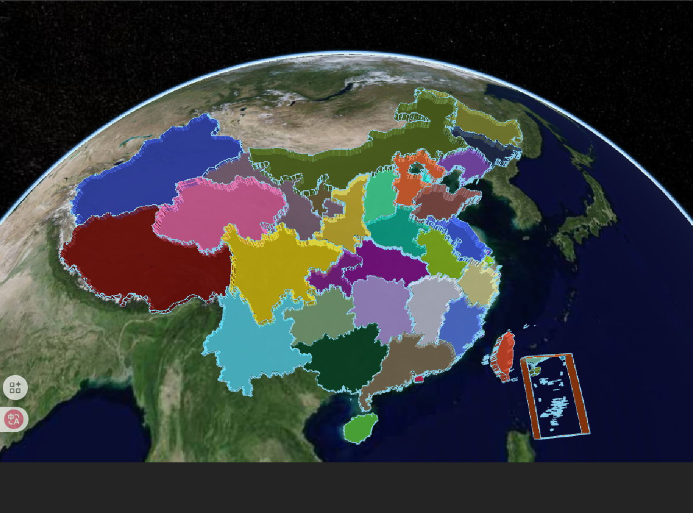
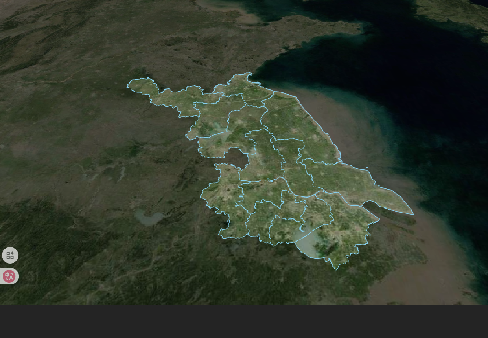
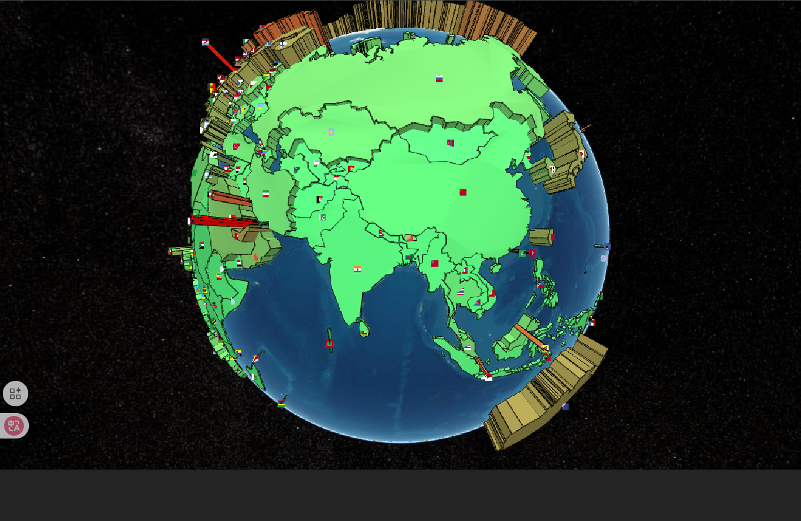

<!-- GeoJson 数据格式
CZML 数据格式
KML 数据格式
MVT 数据格式
SHP 数据格式
dbf 数据格式
prj 数据格式 -->

# Cesium 数据加载详解

## 数据加载核心概念

Cesium 支持多种地理空间数据格式的加载与可视化，每种格式都有其适用场景和性能特点。理解数据加载的核心概念对于构建高效的三维地理信息应用至关重要。

### 数据格式对比

| 数据类别 | 格式                    | 加载策略           | 核心 API            |
| -------- | ----------------------- | ------------------ | ------------------- |
| 矢量数据 | GeoJSON、KML、CZML      | 批量加载、按需加载 | DataSource API      |
| 影像数据 | WMTS、WMS、TMS          | 瓦片化加载、LOD    | ImageryProvider API |
| 地形数据 | Quantized Mesh          | 流式 LOD 加载      | TerrainProvider API |
| 三维模型 | 3D Tiles、glTF          | 分层加载、实例化   | Cesium3DTileset API |
| 点云数据 | LAS、LAZ、3D Tiles 点云 | 分块加载、降采样   | PointCloud API      |

## GeoJson 数据加载

GeoJson 数据是一种常用的地理数据格式，可以通过 `GeoJsonDataSource` 类来实现。

> **注意**：`GeoJsonDataSource.load` 是异步方法，需使用 `await` 或 `.then()` 处理。

### 示例代码

:::details 展开代码

```vue
<template>
  <div ref="cesiumContainer" class="container"></div>
</template>

<script setup>
import { ref, onMounted } from "vue";
import * as Cesium from "cesium";
const cesiumContainer = ref(null);
let viewer = null;

// 天地图TOKEN
const token = "2b34f6afbcd235c2bc4bed3f7735f1f5";

onMounted(() => {
  // 初始化Viewer
  viewer = new Cesium.Viewer(cesiumContainer.value, {
    geocoder: false, // 关闭地理编码搜索
    homeButton: false, // 关闭主页按钮
    sceneModePicker: false, // 关闭场景模式选择器
    baseLayerPicker: false, // 关闭底图选择器
    navigationHelpButton: false, // 关闭导航帮助
    animation: false, // 关闭动画控件
    timeline: false, // 关闭时间轴
    fullscreenButton: false, // 关闭全屏按钮
    baseLayer: false, // 关闭默认地图
  });
  // 清空logo
  viewer.cesiumWidget.creditContainer.style.display = "none";
  initMap();

  // 异步加载中国GeoJson数据
  const geoJsonData = Cesium.GeoJsonDataSource.load(
    "https://geojson.cn/api/china/1.6.2/china.json",
    {
      stroke: Cesium.Color.SKYBLUE, // 边框颜色
      fill: Cesium.Color.PINK, // 填充颜色
      strokeWidth: 3, // 边框宽度
    }
  );

  // 将数据源添加到Viewer中
  geoJsonData.then((dataSource) => {
    viewer.dataSources.add(dataSource);
    // 遍历所有实体
    dataSource.entities.values.forEach((entity) => {
      if (entity.polygon) {
        // 设置随机颜色
        entity.polygon.material = new Cesium.ColorMaterialProperty(
          Cesium.Color.fromRandom({
            alpha: 0.8, // 设置透明度
          })
        );
        // 区域随机拉伸高度
        entity.polygon.extrudedHeight = Math.random() * 100000;
      }
    });
    // 设置视图范围
    viewer.zoomTo(dataSource);
  });
});

// 加载天地图
const initMap = () => {
  // 以下为天地图及天地图标注加载
  const tiandituProvider = new Cesium.WebMapTileServiceImageryProvider({
    url:
      "http://{s}.tianditu.gov.cn/img_w/wmts?service=wmts&request=GetTile&version=1.0.0&LAYER=img&tileMatrixSet=w&TileMatrix={TileMatrix}&TileRow={TileRow}&TileCol={TileCol}&style=default&format=tiles&tk=" +
      token,
    layer: "img",
    style: "default",
    format: "tiles",
    tileMatrixSetID: "w",
    subdomains: ["t0", "t1", "t2", "t3", "t4", "t5", "t6", "t7"], // 子域名
    maximumLevel: 18,
    credit: new Cesium.Credit("天地图影像"),
  });
  // 天地图影像添加到viewer实例的影像图层集合中
  viewer.imageryLayers.addImageryProvider(tiandituProvider);
};
</script>
<style scoped>
.container {
  width: 100vw;
  height: 100vh;
}
</style>
```

:::



### 经典案例(区域掩膜)

实现原理：创建 polygon 覆盖全球，并在其上添加多个洞（holes），每个洞对应一个独立的多边形区域。

:::details 展开代码

```vue
<template>
  <div ref="cesiumContainer" class="container"></div>
</template>

<script setup>
import { ref, onMounted } from "vue";
import * as Cesium from "cesium";
const cesiumContainer = ref(null);
let viewer = null;

// 天地图TOKEN
const token = "2b34f6afbcd235c2bc4bed3f7735f1f5";

onMounted(() => {
  // 初始化Viewer
  viewer = new Cesium.Viewer(cesiumContainer.value, {
    geocoder: false, // 关闭地理编码搜索
    homeButton: false, // 关闭主页按钮
    sceneModePicker: false, // 关闭场景模式选择器
    baseLayerPicker: false, // 关闭底图选择器
    navigationHelpButton: false, // 关闭导航帮助
    animation: false, // 关闭动画控件
    timeline: false, // 关闭时间轴
    fullscreenButton: false, // 关闭全屏按钮
    baseLayer: false, // 关闭默认地图
  });
  // 清空logo
  viewer.cesiumWidget.creditContainer.style.display = "none";
  initMap();

  // 区域掩膜
  const geoJsonData = new Cesium.GeoJsonDataSource().load(
    "/src/cesium/models/jiangsu.json",
    {
      stroke: Cesium.Color.SKYBLUE, // 边框颜色
      fill: Cesium.Color.fromAlpha(Cesium.Color.WHITE, 0), // 填充颜色
      strokeWidth: 3, // 边框宽度
    }
  );

  geoJsonData.then((datasource) => {
    viewer.dataSources.add(datasource);
    viewer.flyTo(datasource, { duration: 3 });

    // 存储所有洞的区域（每个独立多边形一个数组）
    const holes = [];

    // 收集所有多边形点位（按独立区域分组）
    datasource.entities.values.forEach((entity) => {
      const hierarchy = entity.polygon.hierarchy.getValue(
        Cesium.JulianDate.now()
      );
      if (hierarchy) {
        holes.push(hierarchy.positions); // 每个区域单独存储
      }
    });
    // 创建覆盖全球的蒙层（带多个洞）
    viewer.entities.add({
      polygon: {
        hierarchy: new Cesium.PolygonHierarchy(
          Cesium.Cartesian3.fromDegreesArray([30, 0, 30, 89, 180, 89, 180, 0]),
          holes.map((hole) => new Cesium.PolygonHierarchy(hole))
        ),
        material: Cesium.Color.BLACK.withAlpha(0.4),
      },
      perPositionHeight: true,
    });
  });
});

// 加载天地图
const initMap = () => {
  // 以下为天地图及天地图标注加载
  const tiandituProvider = new Cesium.WebMapTileServiceImageryProvider({
    url:
      "http://{s}.tianditu.gov.cn/img_w/wmts?service=wmts&request=GetTile&version=1.0.0&LAYER=img&tileMatrixSet=w&TileMatrix={TileMatrix}&TileRow={TileRow}&TileCol={TileCol}&style=default&format=tiles&tk=" +
      token,
    layer: "img",
    style: "default",
    format: "tiles",
    tileMatrixSetID: "w",
    subdomains: ["t0", "t1", "t2", "t3", "t4", "t5", "t6", "t7"], // 子域名
    maximumLevel: 18,
    credit: new Cesium.Credit("天地图影像"),
  });
  // 天地图影像添加到viewer实例的影像图层集合中
  viewer.imageryLayers.addImageryProvider(tiandituProvider);
};
</script>
<style scoped>
.container {
  width: 100vw;
  height: 100vh;
}
</style>
```

:::



## CZML 数据加载

CZML（Cesium Language）是一种用于描述动态场景的 JSON 格式，专门为 Cesium 设计。它允许开发者描述`随时间变化`的图形和属性，特别适合用于描述移动对象、传感器范围、轨迹等动态场景。

### 示例代码

案例来自于 [Cesium 官方文档](https://sandcastle.cesium.com/index.html?src=CZML%20Model%20Articulations.html&label=CZML)

:::details 展开代码

```vue
<template>
  <div ref="cesiumContainer" class="container"></div>
</template>

<script setup>
import { ref, onMounted } from "vue";
import * as Cesium from "cesium";
const cesiumContainer = ref(null);
let viewer = null;

// 天地图TOKEN
const token = "2b34f6afbcd235c2bc4bed3f7735f1f5";

onMounted(() => {
  // 初始化Viewer
  viewer = new Cesium.Viewer(cesiumContainer.value, {
    geocoder: false, // 关闭地理编码搜索
    homeButton: false, // 关闭主页按钮
    sceneModePicker: false, // 关闭场景模式选择器
    baseLayerPicker: false, // 关闭底图选择器
    navigationHelpButton: false, // 关闭导航帮助
    animation: false, // 关闭动画控件
    timeline: false, // 关闭时间轴
    fullscreenButton: false, // 关闭全屏按钮
    baseLayer: false, // 关闭默认地图
  });
  // 清空logo
  viewer.cesiumWidget.creditContainer.style.display = "none";
  initMap();

  const czml = [
    {
      id: "document",
      name: "CZML Model",
      version: "1.0",
      clock: {
        interval: "2019-06-01T16:00:00Z/2019-06-01T16:10:00Z",
        currentTime: "2019-06-01T16:00:00Z",
        multiplier: 60,
        range: "LOOP_STOP",
        step: "SYSTEM_CLOCK_MULTIPLIER",
      },
    },
    {
      id: "test model",
      name: "Cesium Air",
      position: {
        cartographicDegrees: [-77, 37, 10000],
      },
      model: {
        gltf: "https://cesium.com/public/SandcastleSampleData/launchvehicle.glb",
        scale: 2.0,
        minimumPixelSize: 128,
        runAnimations: false,
        articulations: {
          "Fairing Open": {
            epoch: "2019-06-01T16:00:00Z",
            number: [0, 0, 600, 120],
          },
          "Fairing Separate": {
            epoch: "2019-06-01T16:00:00Z",
            number: [0, 0, 400, -50],
          },
          "Fairing Drop": {
            epoch: "2019-06-01T16:00:00Z",
            interpolationAlgorithm: "LAGRANGE",
            interpolationDegree: 2,
            number: [0, 0, 80, 0, 100, 0, 120, -1, 600, -120],
          },
        },
      },
    },
  ];

  // 加载CZML数据
  viewer.clock.shouldAnimate = true; // 开启动画

  const dataSource = Cesium.CzmlDataSource.load(czml);
  viewer.dataSources
    .add(dataSource)
    .then(function (dataSource) {
      viewer.trackedEntity = dataSource.entities.getById("test model");
    })
    .catch(function (error) {
      console.error(error);
    });
});

// 加载天地图
const initMap = () => {
  // 以下为天地图及天地图标注加载
  const tiandituProvider = new Cesium.WebMapTileServiceImageryProvider({
    url:
      "http://{s}.tianditu.gov.cn/img_w/wmts?service=wmts&request=GetTile&version=1.0.0&LAYER=img&tileMatrixSet=w&TileMatrix={TileMatrix}&TileRow={TileRow}&TileCol={TileCol}&style=default&format=tiles&tk=" +
      token,
    layer: "img",
    style: "default",
    format: "tiles",
    tileMatrixSetID: "w",
    subdomains: ["t0", "t1", "t2", "t3", "t4", "t5", "t6", "t7"], // 子域名
    maximumLevel: 18,
    credit: new Cesium.Credit("天地图影像"),
  });
  // 天地图影像添加到viewer实例的影像图层集合中
  viewer.imageryLayers.addImageryProvider(tiandituProvider);
};
</script>
<style scoped>
.container {
  width: 100vw;
  height: 100vh;
}
</style>
```

:::

<video controls width="600">
  <source src="./imgs/CZML.mp4" type="video/mp4" />
  您的浏览器不支持HTML5视频标签。
</video>

### 获取实体

可以通过 `dataSource.entities.getById("test model")` 获取到 CZML 中定义的实体。

## KML 数据加载

KML（Keyhole Markup Language）是一种基于 XML 的地理数据格式，用于在地理浏览器中表示地理特征和可视化数据

KML 核心特点：

- XML 格式：结构化、可读性强
- 支持多种地理特征：点、线、面、模型、图像叠加层等
- 样式丰富：支持自定义图标、颜色、标签等
- 层级结构：通过文件夹组织内容
- 时间支持：可表示时间动画数据
- 网络链接：支持动态加载远程资源

### 示例代码

案例来自于 [Cesium 官方文档](https://sandcastle.cesium.com/index.html?src=KML.html&label=CZML)

:::details 展开代码

```vue
<template>
  <div ref="cesiumContainer" class="container"></div>
</template>

<script setup>
import { ref, onMounted } from "vue";
import * as Cesium from "cesium";
const cesiumContainer = ref(null);
let viewer = null;

// 天地图TOKEN
const token = "2b34f6afbcd235c2bc4bed3f7735f1f5";

onMounted(() => {
  // 初始化Viewer
  viewer = new Cesium.Viewer(cesiumContainer.value, {
    geocoder: false, // 关闭地理编码搜索
    homeButton: false, // 关闭主页按钮
    sceneModePicker: false, // 关闭场景模式选择器
    baseLayerPicker: false, // 关闭底图选择器
    navigationHelpButton: false, // 关闭导航帮助
    animation: false, // 关闭动画控件
    timeline: false, // 关闭时间轴
    fullscreenButton: false, // 关闭全屏按钮
    baseLayer: false, // 关闭默认地图
  });
  // 清空logo
  viewer.cesiumWidget.creditContainer.style.display = "none";
  initMap();

  viewer.dataSources.add(
    Cesium.KmlDataSource.load(
      new URL("./models/kml/gdpPerCapita2008.kmz", import.meta.url).href,
      {
        camera: viewer.scene.camera,
        canvas: viewer.scene.canvas,
      }
    )
  );
});

// 加载天地图
const initMap = () => {
  // 以下为天地图及天地图标注加载
  const tiandituProvider = new Cesium.WebMapTileServiceImageryProvider({
    url:
      "http://{s}.tianditu.gov.cn/img_w/wmts?service=wmts&request=GetTile&version=1.0.0&LAYER=img&tileMatrixSet=w&TileMatrix={TileMatrix}&TileRow={TileRow}&TileCol={TileCol}&style=default&format=tiles&tk=" +
      token,
    layer: "img",
    style: "default",
    format: "tiles",
    tileMatrixSetID: "w",
    subdomains: ["t0", "t1", "t2", "t3", "t4", "t5", "t6", "t7"], // 子域名
    maximumLevel: 18,
    credit: new Cesium.Credit("天地图影像"),
  });
  // 天地图影像添加到viewer实例的影像图层集合中
  viewer.imageryLayers.addImageryProvider(tiandituProvider);
};
</script>
<style scoped>
.container {
  width: 100vw;
  height: 100vh;
}
</style>
```

:::


