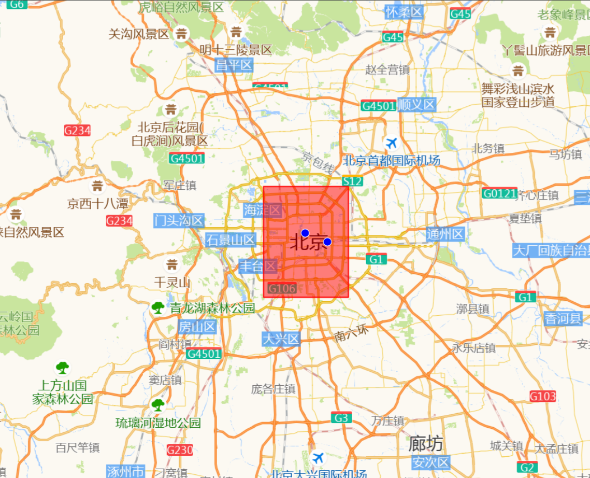

# 地理空间分析插件

主要介绍 WebGIS 中常用的通用地理空间分析插件。像 Leaflet、Mapbox GL JS、OpenLayers 等地图库的定制化插件不在此处详述，[更多插件介绍参考](https://article.juejin.cn/post/7196614877309370427)

## Turf.js

这个必须是第一位，Turf.js 在 WebGIS 插件中占据举足轻重的地位。大家可以当看 UI 库一样从头到尾过一遍，说不定能解决困惑许久的难题

- **功能**：

  - 提供 150+地理空间分析函数，包括缓冲区计算（`buffer`）、距离测量（`distance`）、空间关系判断（`booleanPointInPolygon`）、叠加分析（`intersect`）等。
  - 所有操作都基于 GeoJSON 格式

- **中文网**：[https://turfjs.fenxianglu.cn/](https://turfjs.fenxianglu.cn/)

- **安装与使用**：

  ```bash
  npm install @turf/turf
  ```

  ```js
  import * as turf from "@turf/turf";
  // 创建一个点
  const point = turf.point([116.397, 39.916]);
  // 计算点周围50公里的缓冲区
  const buffered = turf.buffer(point, 50, { units: "kilometers" });
  console.log("缓冲区GeoJSON:", buffered);

  // 判断一个点是否在多边形内
  const polygon = turf.polygon([
    [
      [0, 0],
      [0, 10],
      [10, 10],
      [10, 0],
      [0, 0],
    ],
  ]);
  const testPoint = turf.point([5, 5]);
  const isInPolygon = turf.booleanPointInPolygon(testPoint, polygon);
  console.log("点是否在多边形内:", isInPolygon);
  ```

## proj4.js

- **功能**：

  - 坐标系转换（如 WGS84 转 Web 墨卡托  `EPSG:4326 → EPSG:3857`）
  - 支持自定义坐标系（通过`proj4.defs`定义参数）

- **文档**：[Proj4js 官方文档](http://proj4js.org/)

- **安装与使用**：

  ```bash
  npm install proj4
  ```

  ```js
  import proj4 from "proj4";
  proj4.defs("EPSG:4490", "+proj=longlat +datum=CGCS2000"); // 定义CGCS2000坐标系
  const point = [116.397516, 39.916639];
  const converted = proj4("EPSG:4326", "EPSG:4490", point); // WGS84转CGCS2000
  ```

## Terraformer-WKT-Parser

- **功能**：

  - WKT 与 GeoJSON 互转

- **文档**：[Terraformer-WKT-Parser GitHub](https://github.com/Esri/terraformer-wkt-parser)

- **安装与使用**：

  ```bash
  npm install terraformer-wkt-parser
  ```

  ```javascript
  import WKT from "terraformer-wkt-parser";
  // WKT → GeoJSON
  const wktPoint = "POINT(116.397 39.916)";
  const geojsonPoint = WKT.parse(wktPoint);
  console.log("WKT 转 GeoJSON (点):", geojsonPoint);

  const wktPolygon = "POLYGON ((30 10, 40 40, 20 40, 10 20, 30 10))";
  const geojsonPolygon = WKT.parse(wktPolygon);
  console.log("WKT 转 GeoJSON (多边形):", geojsonPolygon);

  // GeoJSON → WKT
  const geojsonLine = {
    type: "LineString",
    coordinates: [
      [-77, 38],
      [-76, 39],
      [-75, 38],
    ],
  };
  const wktLine = WKT.convert(geojsonLine);
  console.log("GeoJSON 转 WKT (线):", wktLine);
  ```

## gcoord

`gcoord` 是一个专门为中国地理坐标系设计的坐标转换库，解决了国内常见的坐标系偏移问题。

- **功能**：

  - 支持 WGS84、GCJ02 (火星坐标系，高德/腾讯地图使用)、BD09 (百度坐标系) 之间的相互转换。
  - 提供坐标纠偏功能，解决国内地图数据与实际地理位置的偏差。
  - 支持点、线、多边形等 GeoJSON 几何类型的转换。

- **文档**：[gcoord GitHub](https://github.com/hujiulong/gcoord)
- **安装与使用**：

```shellscript
npm install gcoord
```

```javascript
import gcoord from "gcoord";

// WGS84 坐标 (例如 GPS 设备获取的原始坐标)
const wgs84Point = [116.403963, 39.913709]; // 天安门广场 WGS84 坐标

// WGS84 转 GCJ02 (高德/腾讯地图坐标)
const gcj02Point = gcoord.transform(wgs84Point, gcoord.WGS84, gcoord.GCJ02);
console.log("WGS84 转 GCJ02:", gcj02Point);

// GCJ02 转 BD09 (百度地图坐标)
const bd09Point = gcoord.transform(gcj02Point, gcoord.GCJ02, gcoord.BD09);
console.log("GCJ02 转 BD09:", bd09Point);

// BD09 转 WGS84 (用于数据存储或国际标准地图)
const backToWgs84 = gcoord.transform(bd09Point, gcoord.BD09, gcoord.WGS84);
console.log("BD09 转 WGS84:", backToWgs84);

// 转换 GeoJSON 几何
const geojsonLine = {
  type: "LineString",
  coordinates: [
    [116.397, 39.916],
    [116.4, 39.92],
    [116.405, 39.918],
  ],
};

const transformedLine = gcoord.transform(
  geojsonLine,
  gcoord.WGS84,
  gcoord.GCJ02
);
console.log("GeoJSON LineString WGS84 转 GCJ02:", transformedLine);
```

## geojson-vt

`geojson-vt` 是一个高性能的 JavaScript 库，用于将 GeoJSON 数据切片为矢量瓦片 (Vector Tiles)，显著提高地图加载和渲染速度。

- **功能**：

  - 将大型 GeoJSON 数据集处理成适合地图瓦片系统使用的矢量瓦片。
  - 支持动态切片，可以根据地图视口和缩放级别实时生成瓦片。
  - 提供瓦片数据，可与 Leaflet、Mapbox GL JS 等地图库结合使用，实现高性能的矢量数据渲染。

- **特点/优势**：

- **性能出色**：特别适用于需要处理大量 GeoJSON 数据的项目，例如显示全国范围的地理数据、复杂的路网或行政区划。
- **动态加载**：只加载和渲染当前视口所需的瓦片，减少内存占用和网络传输。
- **客户端处理**：切片过程在客户端完成，减轻服务器压力。
- **灵活配置**：支持设置瓦片大小、容差、最大缩放级别等参数。

- **文档**：[geojson-vt GitHub](https://github.com/mapbox/geojson-vt)
- **安装与使用**：

```shellscript
npm install geojson-vt
```

:::details 展开代码

```vue
<template>
  <div ref="mapContainer" id="map"></div>
</template>

<script setup>
import { ref, onMounted } from "vue";
import Map from "ol/Map.js";
import XYZ from "ol/source/XYZ.js";
import TileLayer from "ol/layer/Tile.js";
import View from "ol/View.js";
import { fromLonLat } from "ol/proj"; // 用于坐标转换
import VectorTileLayer from "ol/layer/VectorTile.js";
import VectorTileSource from "ol/source/VectorTile.js";
import Feature from "ol/Feature.js";
import { Point, LineString, Polygon } from "ol/geom"; // 导入几何类型
import { Fill, Stroke, Style, Circle } from "ol/style"; // 导入样式
import "ol/ol.css";
import geojsonvt from "geojson-vt";

const mapContainer = ref(null);
let map = null;
let tileIndex = null; // 存储 geojson-vt 索引

onMounted(() => {
  initMap();
});

const initMap = () => {
  // 1. 准备 GeoJSON 数据
  const largeGeoJSON = {
    type: "FeatureCollection",
    features: [
      {
        type: "Feature",
        geometry: {
          type: "Point",
          coordinates: [116.397516, 39.916639], // 北京天安门附近
        },
        properties: {
          name: "Tiananmen Square",
        },
      },
      {
        type: "Feature",
        geometry: {
          type: "Polygon",
          coordinates: [
            [
              [116.3, 39.8],
              [116.5, 39.8],
              [116.5, 40.0],
              [116.3, 40.0],
              [116.3, 39.8],
            ],
          ],
        },
        properties: {
          name: "Beijing Area",
        },
      },
      {
        type: "Feature",
        geometry: {
          type: "LineString",
          coordinates: [
            [116.35, 39.95],
            [116.45, 39.95],
          ],
        },
        properties: {
          name: "Beijing Road",
        },
      },
      {
        type: "Feature",
        geometry: {
          type: "Point",
          coordinates: [116.45, 39.9], // 另一个点
        },
        properties: {
          name: "Another Point",
        },
      },
    ],
  };

  // 2. 创建 geojson-vt 瓦片索引
  tileIndex = geojsonvt(largeGeoJSON, {
    maxZoom: 18, // 确保覆盖 OpenLayers 的缩放范围
    minZoom: 0,
    tolerance: 3,
    extent: 4096, // 瓦片内部坐标范围
  });

  // 3. 定义矢量瓦片图层样式
  const vectorTileStyle = new Style({
    fill: new Fill({
      color: "rgba(255, 0, 0, 0.5)", // 红色半透明填充
    }),
    stroke: new Stroke({
      color: "red", // 红色边框
      width: 2,
    }),
    image: new Circle({
      radius: 7,
      fill: new Fill({
        color: "blue", // 蓝色点
      }),
      stroke: new Stroke({
        color: "white",
        width: 1,
      }),
    }),
  });

  // 4. 创建 VectorTileSource
  const vectorSource = new VectorTileSource({
    format: null, // 不需要内置格式解析器，因为我们手动处理
    url: "vector-tile://{z}/{x}/{y}", // 这是一个虚拟的URL，仅用于触发tileLoadFunction
    tileLoadFunction: function (tile, url) {
      const [z, x, y] = url
        .replace("vector-tile://", "")
        .split("/")
        .map(Number);
      const data = tileIndex.getTile(z, x, y);
      const extent = 4096;
      const tile2lon = (x, z) => (x / Math.pow(2, z)) * 360 - 180;
      const tile2lat = (y, z) => {
        const n = Math.PI - (2 * Math.PI * y) / Math.pow(2, z);
        return (180 / Math.PI) * Math.atan(0.5 * (Math.exp(n) - Math.exp(-n)));
      };
      // 将瓦片像素坐标转为经纬度
      function pixelToLngLat(px, py, z, x, y) {
        const n = Math.pow(2, z);
        const tileX = x + px / extent;
        const tileY = y + py / extent;
        const lon = tile2lon(tileX, z);
        const lat = tile2lat(tileY, z);
        return [lon, lat];
      }
      const features = [];
      if (data && data.features) {
        data.features.forEach((feature) => {
          let geometry;
          switch (feature.type) {
            case 1: // Point
              geometry = new Point(
                pixelToLngLat(
                  feature.geometry[0][0],
                  feature.geometry[0][1],
                  z,
                  x,
                  y
                )
              );
              geometry = geometry.transform("EPSG:4326", "EPSG:3857");
              break;
            case 2: // LineString
              geometry = new LineString(
                feature.geometry.map((coord) =>
                  pixelToLngLat(coord[0], coord[1], z, x, y)
                )
              );
              geometry = geometry.transform("EPSG:4326", "EPSG:3857");
              break;
            case 3: // Polygon
              geometry = new Polygon([
                feature.geometry[0].map((coord) =>
                  pixelToLngLat(coord[0], coord[1], z, x, y)
                ),
              ]);
              geometry = geometry.transform("EPSG:4326", "EPSG:3857");
              break;
            default:
              return;
          }
          const olFeature = new Feature({
            geometry: geometry,
            properties: feature.tags,
          });
          features.push(olFeature);
        });
      }
      tile.setFeatures(features);
    },
  });

  // 5. 创建 VectorTileLayer
  const vectorLayer = new VectorTileLayer({
    source: vectorSource,
    style: vectorTileStyle, // 应用样式
  });

  // 6. 初始化地图
  map = new Map({
    target: mapContainer.value,
    controls: [], // 禁用默认控件
    layers: [
      new TileLayer({
        source: new XYZ({
          // 高德地图矢量图（含路网、含注记）
          // 注意：高德地图通常使用 EPSG:3857 投影
          url: "http://wprd0{1-4}.is.autonavi.com/appmaptile?x={x}&y={y}&z={z}&lang=zh_cn&size=1&scl=1&style=7 ",
        }),
      }),
      vectorLayer, // 添加矢量瓦片图层
    ],
    view: new View({
      // 将中心点从 EPSG:4326 转换为 EPSG:3857
      center: fromLonLat([116.4074, 39.9042]), // 北京市中心经纬度
      zoom: 10,
      projection: "EPSG:3857", // 确保投影与高德地图瓦片一致
    }),
  });
};
</script>

<style scoped>
#map {
  position: absolute;
  top: 0;
  bottom: 0;
  width: 100%;
}
</style>
```

:::



## ts-shapefile

`ts-shapefile` 是一个用于在 TypeScript/JavaScript 环境中处理 ESRI Shapefile 格式的库。它主要用于读取 Shapefile 数据并将其转换为 GeoJSON 格式。`(我也没有真正使用过该插件)`

- **功能**：

- 读取 `.shp` (几何数据) 和 `.dbf` (属性数据) 文件。
- 将 Shapefile 数据解析为 GeoJSON FeatureCollection 格式。
- 支持多种 Shapefile 几何类型，如点、线、多边形。

- **特点/优势**：

- 纯 JavaScript 实现，可在浏览器和 Node.js 环境中使用。
- 方便将传统的 Shapefile 数据集成到现代 WebGIS 应用中。
- 对于需要处理旧版或特定格式地理数据的项目非常有用。

- **文档**：[ts-shapefile GitHub](https://github.com/calvinmetcalf/ts-shapefile)
- **安装与使用**：

```bash
npm install ts-shapefile
```

```javascript
// 假设你有一个名为 'data.shp' 和 'data.dbf' 的 Shapefile 文件
// 在浏览器环境中，你可能需要通过文件输入或 fetch API 获取 ArrayBuffer
// 在 Node.js 环境中，你可以直接读取文件

import { parseShp, parseDbf } from "ts-shapefile";
import fs from "fs"; // Node.js 环境

async function loadShapefile() {
  try {
    // 示例：在 Node.js 环境中读取文件
    const shpBuffer = fs.readFileSync("path/to/your/data.shp");
    const dbfBuffer = fs.readFileSync("path/to/your/data.dbf");

    const geojsonFeatures = await parseShp(shpBuffer);
    const dbfRecords = await parseDbf(dbfBuffer);

    // 将几何和属性合并为完整的 GeoJSON FeatureCollection
    const featureCollection = {
      type: "FeatureCollection",
      features: geojsonFeatures.map((geom, index) => ({
        type: "Feature",
        geometry: geom,
        properties: dbfRecords[index] || {}, // 确保属性存在
      })),
    };

    console.log(
      "Shapefile 转换为 GeoJSON:",
      JSON.stringify(featureCollection, null, 2)
    );
  } catch (error) {
    console.error("读取 Shapefile 失败:", error);
  }
}

// loadShapefile(); // 调用函数加载 Shapefile
```

**注意**：`ts-shapefile` 主要用于读取 Shapefile。如果需要将 GeoJSON 转换为 Shapefile，通常需要更复杂的服务器端处理或使用 GDAL/OGR 等工具。
