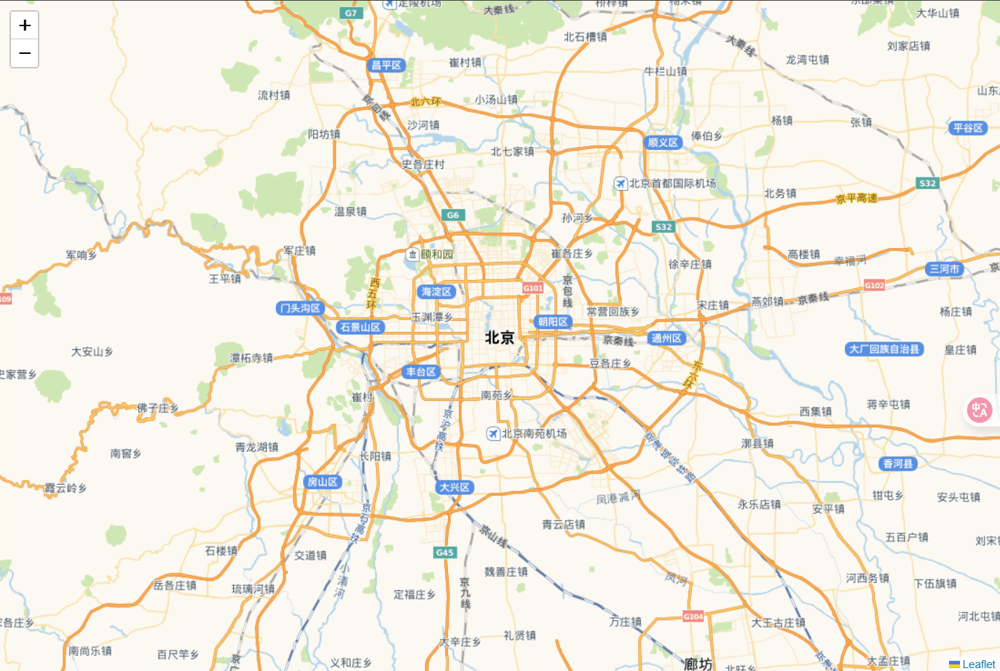

# 🚀 快速构建 Leaflet 地图应用

## 推荐技术栈

```bash
Vue 3.5.13+
Leaflet 1.9.4+
Vite 6.3.5+
```

## 初始化项目

```bash
# 创建Vite项目（选择Vue模板）
npm create vite@latest my-vue-leaflet -- --template vue

# 进入项目目录并安装依赖
cd my-vue-leaflet
npm install

# 安装Leaflet核心库
npm install leaflet --save

# 启动开发服务器
npm run dev
```

## 创建基础地图

**关键注意事项**

容器尺寸：地图容器必须有明确的宽高（推荐使用绝对定位或 flex 布局）

```vue
<template>
  <div>
    <div ref="mapContainer" style="width: 100vw; height: 100vh"></div>
  </div>
</template>

<script setup>
import { ref, onMounted } from "vue";
import L from "leaflet";
import "leaflet/dist/leaflet.css";

const mapContainer = ref(null);

onMounted(() => {
  // 初始化地图
  let map = L.map(mapContainer.value, {
    center: [39.904, 116.405], // 北京
    zoom: 9.5,
  });

  // 加载高德地图
  L.tileLayer(
    `https://webrd04.is.autonavi.com/appmaptile?lang=zh_cn&size=1&scale=1&style=7&x={x}&y={y}&z={z}`
  ).addTo(map);
});
</script>
```

### 效果图



## 国内地图服务解决方案

| 服务商   | 特点                   | 申请地址   |
| -------- | ---------------------- | ---------- |
| 高德地图 | 更新快，覆盖全         | 无需 Key   |
| 天地图   | 官方权威，支持多种图层 | 需申请 Key |
| 腾讯地图 | 卫星影像质量高         | 需申请 Key |

这里使用了高德地图和天地图作为底图服务，注意替换天地图的 API Key。[申请地址](http://lbs.tianditu.gov.cn/home.html)

## 杂谈

`Leaflet` 操作起来比较简单，官网 API 也就一页，写的简单详细，API 学习直接参考文档
