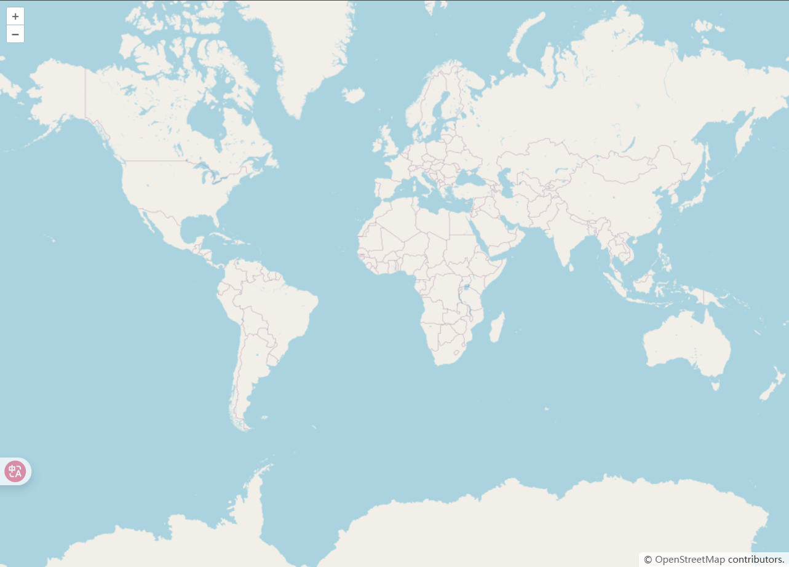
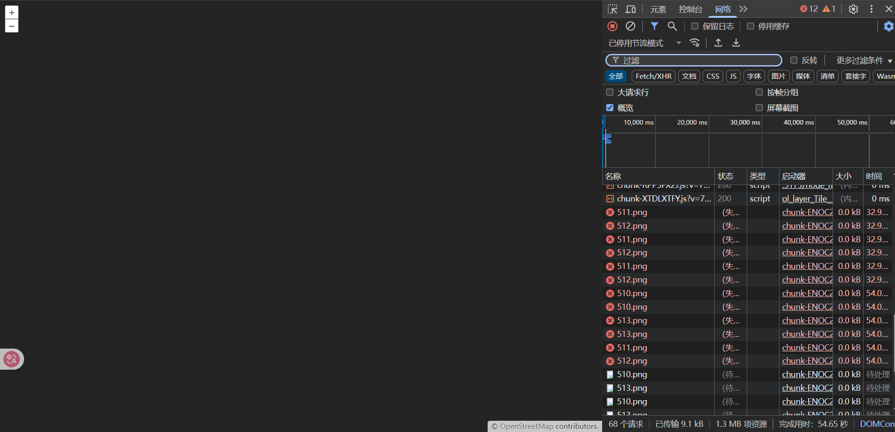
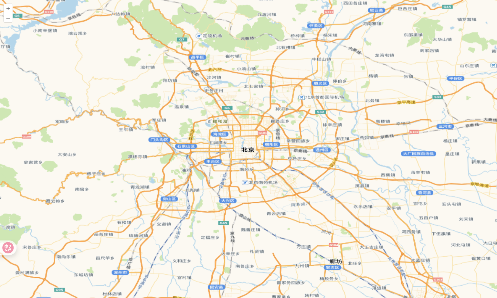

# 🚀 快速构建 OpenLayers 地图应用

## 推荐技术栈

```bash
Vue 3.5.13+
OpenLayers 10.5.0+
Vite 6.3.5+
```

## 初始化项目

```bash
# 创建Vite项目（选择Vue模板）
npm create vite@latest my-vue-ol -- --template vue

# 进入项目目录并安装依赖
cd my-vue-ol
npm install

# 安装OpenLayers核心库
npm install ol --save

# 启动开发服务器
npm run dev
```

## 创建基础地图

**关键注意事项**

1. 容器尺寸：地图容器必须有明确的宽高（推荐使用绝对定位或 flex 布局）
2. 坐标系：默认使用 EPSG:3857（球面墨卡托投影），经纬度坐标需转换
3. 网络限制：OSM 服务在国内不稳定，推荐使用国内底图替代方案

```vue
<template>
  <div ref="mapContainer" id="map"></div>
</template>

<script setup>
import { ref, onMounted } from "vue";
import Map from "ol/Map.js";
import OSM from "ol/source/OSM.js";
import TileLayer from "ol/layer/Tile.js";
import View from "ol/View.js";
import "ol/ol.css";
const mapContainer = ref(null);
let map = null;
onMounted(() => {
  initMap();
});
const initMap = () => {
  map = new Map({
    target: mapContainer.value,
    layers: [
      new TileLayer({
        source: new OSM(), // 官方使用OpenStreetMap作为底图
      }),
    ],
    view: new View({
      center: [0, 0],
      zoom: 2,
    }),
  });
};
</script>
<style scoped>
#map {
  position: absolute;
  top: 0;
  bottom: 0;
  width: 100vw;
  height: 100vh;
}
</style>
```

### 效果图



### 访问受限



## 国内地图服务解决方案

| 服务商   | 特点                   | 申请地址   |
| -------- | ---------------------- | ---------- |
| 高德地图 | 更新快，覆盖全         | 无需 Key   |
| 天地图   | 官方权威，支持多种图层 | 需申请 Key |
| 腾讯地图 | 卫星影像质量高         | 需申请 Key |

这里使用了高德地图和天地图作为底图服务，注意替换天地图的 API Key。[申请地址](http://lbs.tianditu.gov.cn/home.html)

```vue
<template>
  <div ref="mapContainer" id="map"></div>
</template>

<script setup>
import { ref, onMounted } from "vue";
import Map from "ol/Map.js";
import XYZ from "ol/source/XYZ.js";
import TileLayer from "ol/layer/Tile.js";
import View from "ol/View.js";
import "ol/ol.css";
const mapContainer = ref(null);
let map = null;
onMounted(() => {
  initMap();
});
const initMap = () => {
  map = new Map({
    target: mapContainer.value,
    layers: [
      new TileLayer({
        // 设置高德地图为数据源底图
        source: new XYZ({
          // 高德地图瓦片服务地址
          // url: "https://webst01.is.autonavi.com/appmaptile?lang=zh_cn&size=1&scale=1&style=6&x={x}&y={y}&z={z}",
          // 设置路网图层
          url: "https://webrd04.is.autonavi.com/appmaptile?lang=zh_cn&size=1&scale=1&style=7&x={x}&y={y}&z={z}",
          // 设置天地图图层
          // url: "http://t0.tianditu.gov.cn/vec_w/wmts?SERVICE=WMTS&REQUEST=GetTile&VERSION=1.0.0&LAYER=vec&STYLE=default&TILEMATRIXSET=w&FORMAT=tiles&TILEMATRIX={z}&TILEROW={y}&TILECOL={x}&tk=token", // token替换为你的天地图API Key
        }),
      }),
    ],
    view: new View({
      center: [116.4074, 39.9042], // 北京市中心经纬度
      zoom: 10,
      projection: "EPSG:4326", // 默认使用球面墨卡托投影(EPSG:3857)，需要设置为WGS 84(EPSG:4326)经纬度
    }),
  });
};
</script>
<style scoped>
#map {
  position: absolute;
  top: 0;
  bottom: 0;
  width: 100%;
}
</style>
```

### 效果图


