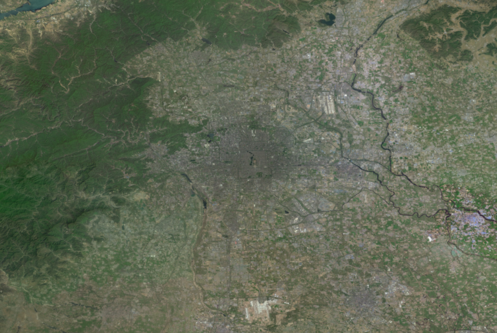
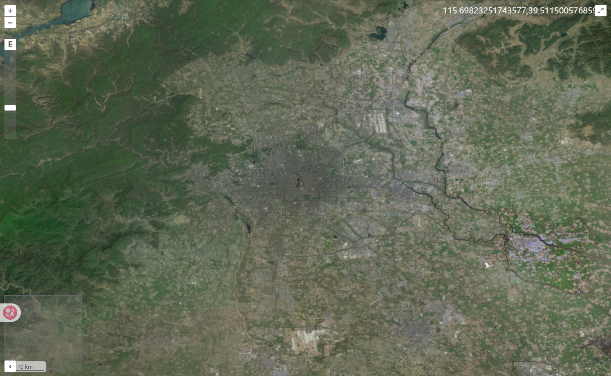
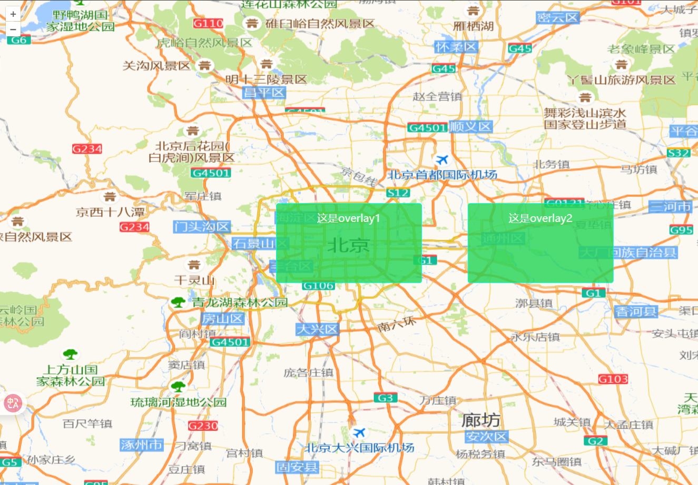
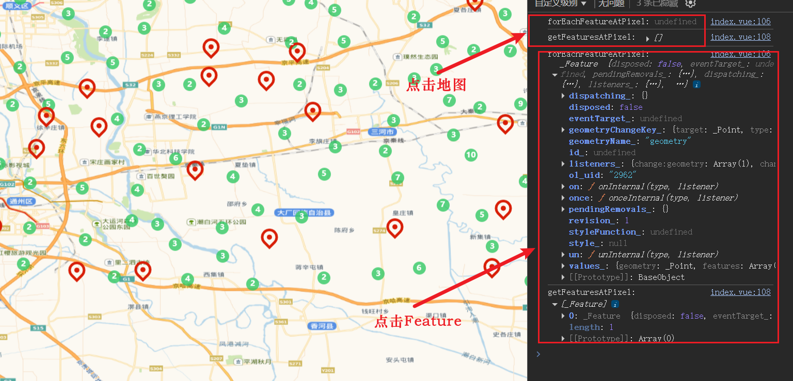

# Map 对象

Map 是 OpenLayers 的核心容器对象，管理所有图层、控件和交互。创建地图实例是使用 OpenLayers 的第一步。

```js
import Map from "ol/Map.js";

// 创建地图对象
new Map(options);
```

## Map 对象

options 配置项有以下属性，接下来会详细说明用法：

| 属性                  | 类型                            | 描述                               |
| --------------------- | ------------------------------- | ---------------------------------- |
| `target`              | `string \| HTMLElement`         | **必需**，地图容器的 DOM 元素或 ID |
| `layers`              | `Array<BaseLayer>`              | 初始图层数组（顺序决定绘制顺序）   |
| `view`                | `View`                          | 地图视图对象                       |
| `controls`            | `Array<Control>`                | 地图控件数组                       |
| `interactions`        | `Array<Interaction>`            | 地图交互数组                       |
| `overlays`            | `Array<Overlay>`                | 地图覆盖物数组                     |
| `pixelRatio`          | `number`                        | 设备像素比（高清屏建议设为 2）     |
| `keyboardEventTarget` | `Element \| Document \| string` | 接收键盘事件的元素                 |
| `maxTilesLoading`     | `number`                        | 最大同时加载的瓦片数量             |
| `moveTolerance`       | `number`                        | 拖动事件触发的最小移动距离（像素） |

### target

**地图渲染的 DOM 容器**，必须设置且容器必须有明确的宽度和高度。

```vue
<template>
  <div ref="mapContainer" class="map-view"></div>
</template>

<script setup>
import { ref, onMounted } from "vue";
import Map from "ol/Map";

const mapContainer = ref(null);
const map = ref(null);

onMounted(() => {
  map.value = new Map({
    target: mapContainer.value, // 使用ref获取DOM元素
    // 其他配置...
  });
});
</script>

<style>
.map-view {
  width: 100%;
  height: 500px;
}
</style>
```

⚠️ **常见问题**：如果地图不显示，请检查：

1. 容器是否设置了宽度和高度
2. 是否在 onMounted 之后初始化地图

### layers

**图层数组**，决定地图内容的绘制顺序（先添加的在底层）。

```js
import Map from "ol/Map.js";
import TileLayer from "ol/layer/Tile";
import XYZ from "ol/source/XYZ.js";

// 高德地图路网图层
const roadLayer = new TileLayer({
  source: new XYZ({
    url: "https://webrd04.is.autonavi.com/appmaptile?lang=zh_cn&size=1&scale=1&style=7&x={x}&y={y}&z={z}",
  }),
});

// 高德地图卫星影像
const satelliteLayer = new TileLayer({
  source: new XYZ({
    url: "https://webst01.is.autonavi.com/appmaptile?lang=zh_cn&size=1&scale=1&style=6&x={x}&y={y}&z={z}",
  }),
});

new Map({
  layers: [roadLayer, satelliteLayer], // 路网图层在下，卫星影像图层在上
  // ...
});
```



> 📘 详细图层用法参考：[Layer 对象](./03_layer对象.md)

### view

**地图视图**，控制显示中心、缩放级别、旋转角度等核心状态。

```js
import View from "ol/View";

const view = new View({
  center: [116.4074, 39.9042], // 初始中心
  zoom: 10, // 初始缩放
  projection: "EPSG:3857", // 推荐使用EPSG:3857坐标系
  minZoom: 3, // 最小缩放
  maxZoom: 18, // 最大缩放
  rotation: Math.PI / 4, // 旋转角度(弧度)
});
new Map({
  view: view, // 设置地图视图
  // 其他配置...
});
```

> 📘 详细视图配置参考：[View 对象](./05_view对象.md)

### controls

**地图控件**，提供用户交互界面元素。默认包含缩放按钮和旋转控件。

- `new Map({ controls: [] })`禁用所有控件。

#### 控件类型

| 控件类型      | 描述                             |
| ------------- | -------------------------------- |
| Zoom          | 缩放控件                         |
| Rotate        | 旋转控件，alt+shift+左键旋转地图 |
| FullScreen    | 全屏控件                         |
| Attribution   | 版权信息控件                     |
| ScaleLine     | 比例尺控件                       |
| MousePosition | 鼠标位置控件                     |
| OverviewMap   | 概览图控件                       |
| ZoomSlider    | 滑动缩放控件                     |
| ZoomToExtent  | 缩放到范围控件                   |

```js
import { defaults as defaultControls } from "ol/control";
import Zoom from "ol/control/Zoom";
import ScaleLine from "ol/control/ScaleLine";

// 自定义控件组（替换默认控件）
const controls = defaultControls({
  zoom: false, // 禁用默认缩放控件
}).extend([
  new Zoom({ className: "custom-zoom" }), // 自定义样式类
  new ScaleLine(),
]);

new Map({ controls });
```

> 📘 详细控件使用参考：[Controls 对象](./06_controls对象.md)



### interactions

**地图交互**，处理用户输入事件。默认包含拖拽平移、滚轮缩放等。

- `new Map({ interactions: [] })`禁用所有交互。

#### 交互类型

| 交互类型           | 描述         |
| ------------------ | ------------ |
| MouseWheelZoom     | 鼠标滚轮缩放 |
| DoubleClickZoom    | 双击缩放     |
| KeyboardPan        | 键盘平移     |
| KeyboardZoom       | 键盘缩放     |
| DblClickDragZoom   | 双击拖动缩放 |
| DragAndDrop        | 拖放交互     |
| Link               | 链接交互     |
| PointerInteraction | 鼠标指针交互 |
| Select             | 选择交互     |

```js
import { defaults as defaultInteractions } from "ol/interaction";
import DragPan from "ol/interaction/DragPan";
import MouseWheelZoom from "ol/interaction/MouseWheelZoom";

// 自定义交互组合
const interactions = defaultInteractions({
  shiftDragZoom: false, // 禁用Shift+拖拽缩放
}).extend([new DragPan(), new MouseWheelZoom()]);

new Map({ interactions });
```

> 📘 详细交互配置参考：[Interaction 对象](./07_interaction对象.md)

### overlays

**地图覆盖物**，用于显示固定位置的 DOM 元素（如标记、弹窗）。

- 更多属性，可参考[overlay 官方文档](https://openlayers.org/en/latest/apidoc/module-ol_Overlay-Overlay.html)。

#### 属性

| 属性        | 描述                         |
| ----------- | ---------------------------- |
| id          | 覆盖物的唯一标识符           |
| element     | 覆盖物的 DOM 元素            |
| position    | 覆盖物的位置坐标             |
| offset      | 覆盖物的偏移量               |
| positioning | 覆盖物的定位方式             |
| stopEvent   | 是否阻止事件冒泡             |
| insertFirst | 是否将覆盖物插入到第一个位置 |
| className   | 覆盖物的 CSS 类名            |
| autoPan     | 是否自动平移地图以显示覆盖物 |

#### 示例

::: details 展开查看代码

```vue
<template>
  <div ref="mapContainer" id="map"></div>
  <div ref="overlay" class="overlay">这是overlay1</div>
  <div ref="overlay2" class="overlay">这是overlay2</div>
</template>

<script setup>
import { ref, onMounted } from "vue";
import Map from "ol/Map.js";
import XYZ from "ol/source/XYZ.js";
import TileLayer from "ol/layer/Tile.js";
import View from "ol/View.js";
import "ol/ol.css";

import Overlay from "ol/Overlay.js";

const mapContainer = ref(null);
const overlay = ref(null);
const overlay2 = ref(null);
let map = null;
onMounted(() => {
  initMap();
});
const initMap = () => {
  map = new Map({
    target: mapContainer.value,
    layers: [
      new TileLayer({
        // 设置高德地图为数据源底图
        source: new XYZ({
          // 矢量图（含路网、含注记）
          url: "http://wprd0{1-4}.is.autonavi.com/appmaptile?x={x}&y={y}&z={z}&lang=zh_cn&size=1&scl=1&style=7 ",
        }),
      }),
    ],
    view: new View({
      center: [116.4074, 39.9042], // 北京市中心经纬度
      zoom: 10,
      projection: "EPSG:4326", // 默认使用球面墨卡托投影(EPSG:3857)，需要设置为WGS 84(EPSG:4326)经纬度
    }),
    overlays: [
      new Overlay({
        id: "overlay1",
        element: overlay.value, // HTML元素
        position: [116.4074, 39.9042], // 设置overlay位置为北京市中心经纬度
        offset: [0, 0], // 设置overlay偏移量
        positioning: "center-center", // 设置overlay位置对齐方式
        stopEvent: false, // 设置为false可以使overlay不阻止事件传播
        autoPan: true, // 自动平移地图以显示overlay
      }),
      new Overlay({
        id: "overlay2",
        element: overlay2.value, // HTML元素
        position: [116.8074, 39.9042], // 设置overlay位置为北京市中心经纬度
        offset: [0, 0], // 设置overlay偏移量
        positioning: "center-center", // 设置overlay位置对齐方式
        stopEvent: false, // 设置为false可以使overlay不阻止事件传播
        autoPan: true, // 自动平移地图以显示overlay
      }),
    ],
  });
};
</script>
<style scoped>
#map {
  position: absolute;
  top: 0;
  bottom: 0;
  width: 100%;
}
.overlay {
  width: 200px;
  height: 100px;
  background: rgba(34, 212, 85, 0.8);
  padding: 10px;
  border: 1px solid aqua;
  border-radius: 4px;
}
</style>
```

:::



#### 常用方法

| 方法            | 参数          | 功能描述       |
| --------------- | ------------- | -------------- |
| `setPosition()` | `[x, y]`      | 更新覆盖物位置 |
| `getPosition()` | -             | 获取当前位置   |
| `setElement()`  | `HTMLElement` | 更换覆盖物元素 |
| `getElement()`  | -             | 获取当前元素   |
| `setOffset()`   | `[x, y]`      | 设置像素偏移量 |
| `getOffset()`   | -             | 获取像素偏移量 |
| `getId()`       | -             | 获取唯一标识符 |

### Map 实例方法

#### 图层管理

| 方法            | 描述                           | 示例                     |
| --------------- | ------------------------------ | ------------------------ |
| `addLayer()`    | 添加图层                       | `map.addLayer(layer)`    |
| `removeLayer()` | 移除图层                       | `map.removeLayer(layer)` |
| `getLayers()`   | 获取图层集合                   | `map.getLayers()`        |
| `setLayers()`   | 清除现有图层并将图层添加到地图 | `map.setLayers(layers)`  |

#### 控件管理

| 方法              | 描述         | 示例                         |
| ----------------- | ------------ | ---------------------------- |
| `addControl()`    | 添加控件     | `map.addControl(control)`    |
| `removeControl()` | 移除控件     | `map.removeControl(control)` |
| `getControls()`   | 获取控件集合 | `map.getControls()`          |

#### 交互管理

| 方法                  | 描述         | 示例                                 |
| --------------------- | ------------ | ------------------------------------ |
| `addInteraction()`    | 添加交互     | `map.addInteraction(interaction)`    |
| `removeInteraction()` | 移除交互     | `map.removeInteraction(interaction)` |
| `getInteractions()`   | 获取交互集合 | `map.getInteractions()`              |

#### 覆盖物管理

| 方法                 | 描述               | 示例                             |
| -------------------- | ------------------ | -------------------------------- |
| `addOverlay()`       | 添加覆盖物         | `map.addOverlay(overlay)`        |
| `removeOverlay()`    | 移除覆盖物         | `map.removeOverlay(overlay)`     |
| `getOverlays()`      | 获取覆盖物集合     | `map.getOverlays()`              |
| `getOverlayById(id)` | 根据 ID 获取覆盖物 | `map.getOverlayById('overlay1')` |

#### 视图操作

| 方法                                     | 描述                                   | 示例                                         |
| ---------------------------------------- | -------------------------------------- | -------------------------------------------- |
| `getView()`                              | 获取当前视图                           | `const view = map.getView()`                 |
| `setView(view)`                          | 设置新视图                             | `map.setView(new View(...))`                 |
| `getSize()`                              | 获取地图尺寸（像素）                   | `const size = map.getSize()`                 |
| `setSize(size)`                          | 设置地图尺寸（像素）                   | `map.setSize([width, height])`               |
| `updateSize()`                           | 容器大小变化后更新                     | `window.onresize = () => map.updateSize()`   |
| `getCoordinateFromPixel(pixel)`          | 从像素获取坐标                         | `map.getCoordinateFromPixel([x, y])`         |
| `getPixelFromCoordinate(coord)`          | 从坐标获取像素                         | `map.getPixelFromCoordinate([lng, lat])`     |
| `getEventPixel(event)`                   | 返回相对于视口的浏览器事件地图像素位置 | `map.getEventPixel(event)`                   |
| `getTarget()`                            | 获取地图容器的 DOM 元素或其 ID         | `map.getTarget()`                            |
| `getTargetElement()`                     | 获取地图容器的 DOM 元素                | `map.getTargetElement()`                     |
| `getViewport()`                          | 获取地图的视口元素                     | `map.getViewport()`                          |
| `hasFeatureAtPixel(pixel)`               | 判断指定像素位置是否有要素             | `map.hasFeatureAtPixel(pixel)`               |
| `forEachFeatureAtPixel(pixel, callback)` | 屏幕坐标获取要素                       | `map.forEachFeatureAtPixel(pixel, callback)` |
| `getEventCoordinate(event)`              | 根据事件获取经纬度坐标                 | `map.getEventCoordinate(event)`              |
| `getFeaturesAtPixel(pixel)`              | 屏幕坐标获取要素                       | `map.getFeaturesAtPixel(pixel)`              |

```js
// forEachFeatureAtPixel - 屏幕坐标获取要素
// getFeaturesAtPixel - 屏幕坐标获取要素
map.on("click", (event) => {
  const forEachFeatureAtPixel = map.forEachFeatureAtPixel(
    event.pixel,
    (feature) => {
      return feature; // 点击的要素
    }
  );
  console.log("forEachFeatureAtPixel:", forEachFeatureAtPixel);
  const getFeaturesAtPixel = map.getFeaturesAtPixel(event.pixel);
  console.log("getFeaturesAtPixel:", getFeaturesAtPixel);
});
```



#### 事件处理

| 方法     | 描述           | 示例                   |
| -------- | -------------- | ---------------------- |
| `on()`   | 绑定事件       | `map.on('click', fn)`  |
| `un()`   | 解绑事件       | `map.un('click', fn)`  |
| `once()` | 绑定一次性事件 | `map.once('load', fn)` |

```js
// 点击获取要素
map.on("click", (event) => {
  const features = map.getFeaturesAtPixel(event.pixel);

  features.forEach((feature) => {
    console.log("要素属性:", feature.getProperties());
  });
});
```

#### 其它常用方法

| 方法              | 描述                           | 示例                  |
| ----------------- | ------------------------------ | --------------------- |
| `getProperties()` | 获取地图的属性                 | `map.getProperties()` |
| `render()`        | 重新渲染地图（在下一个动画帧） | `map.render()`        |
| `renderSync()`    | 同步渲染地图                   | `map.renderSync()`    |

#### 销毁地图

```js
// 组件卸载时调用（方式一）
map.dispose();

// 组件卸载时调用（方式二）
map.setTarget(null)
```
