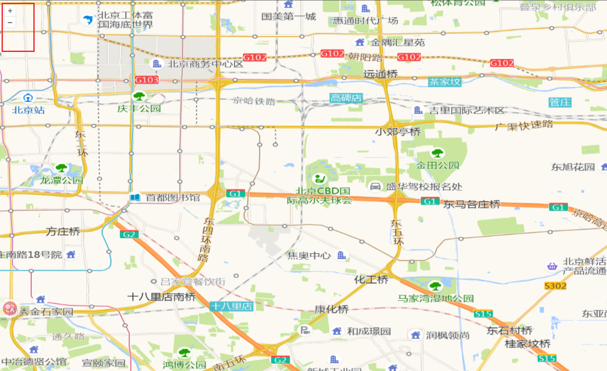
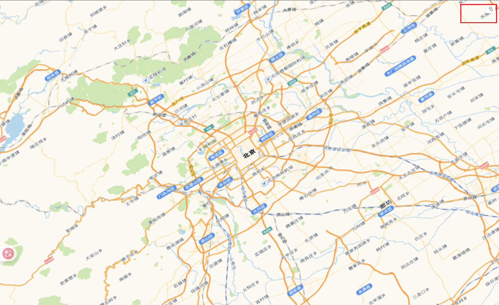
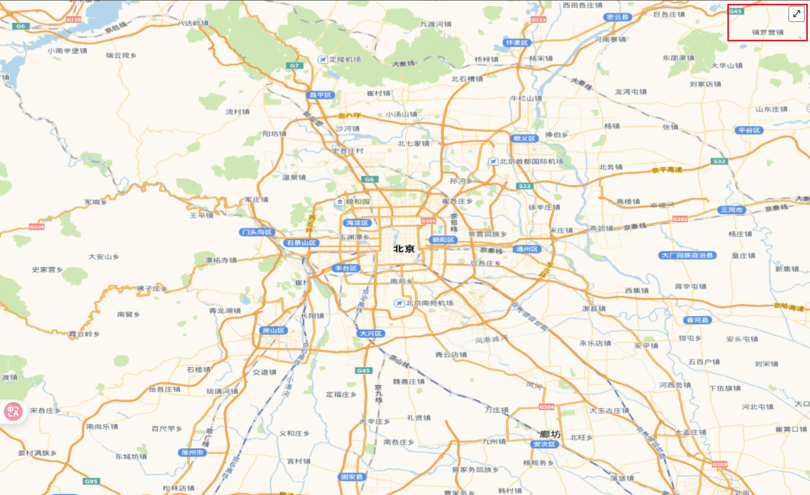
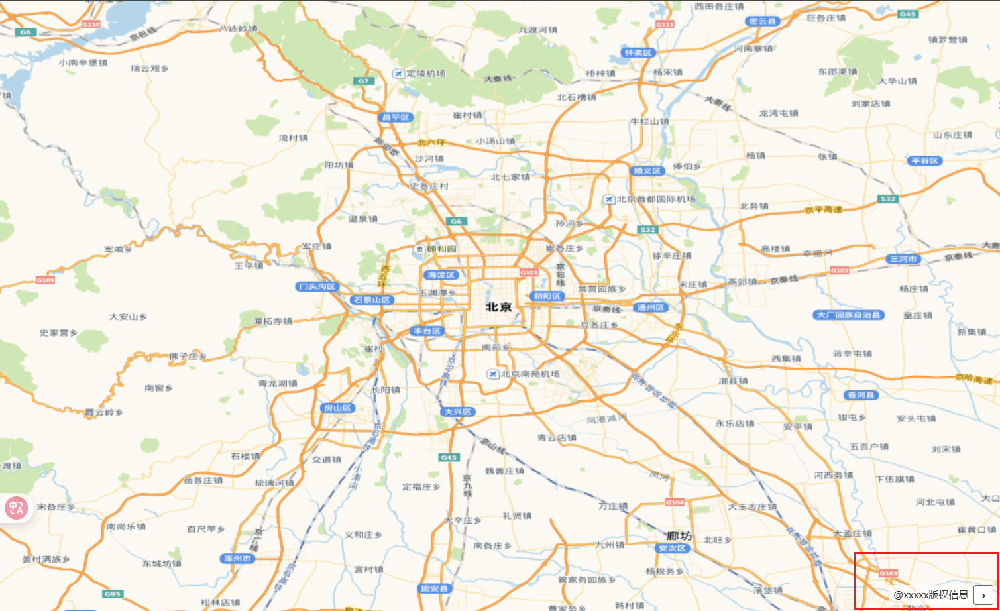
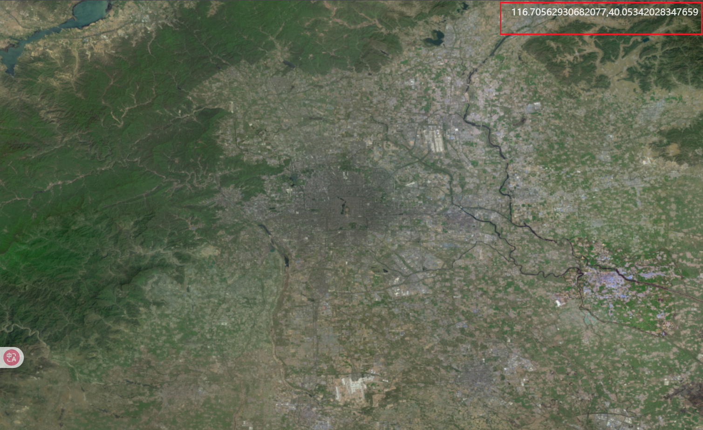
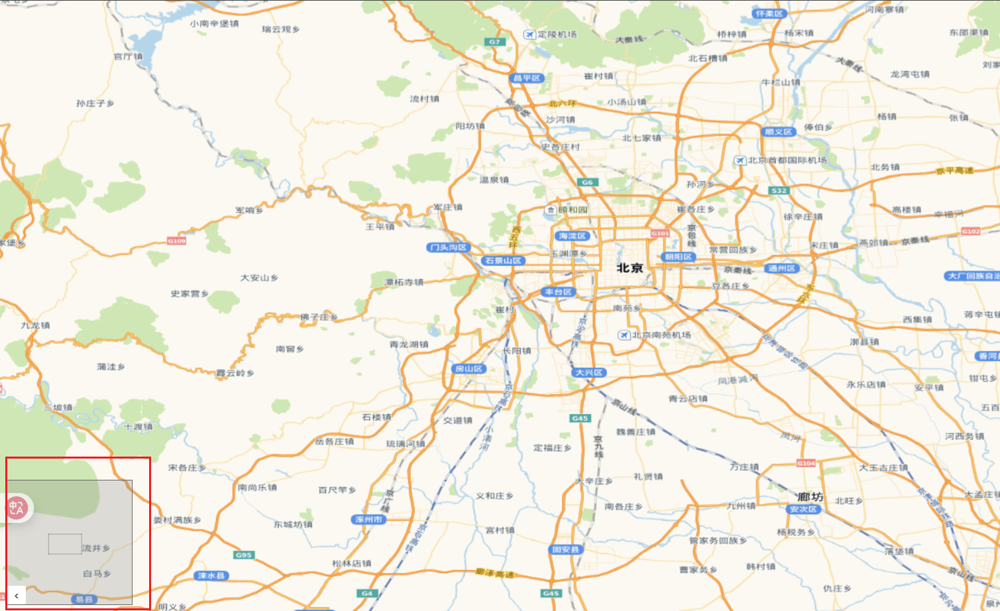
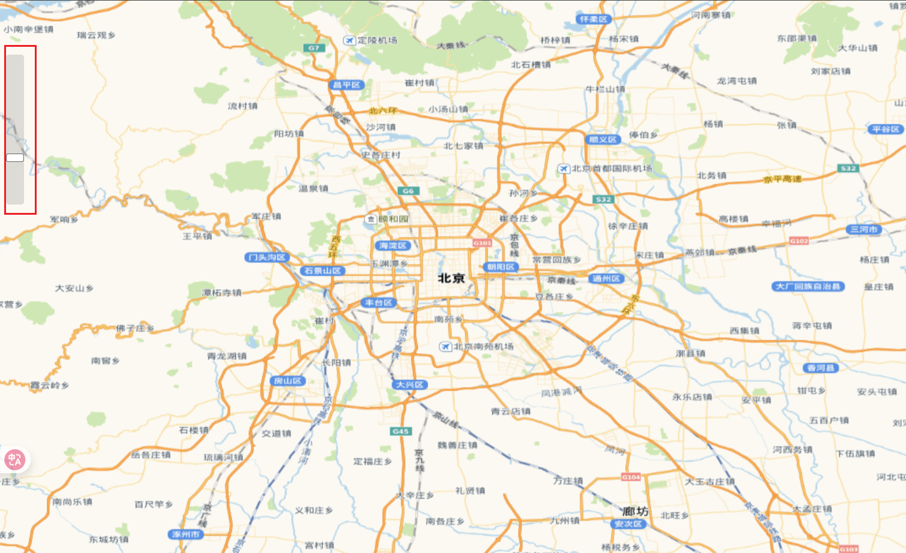
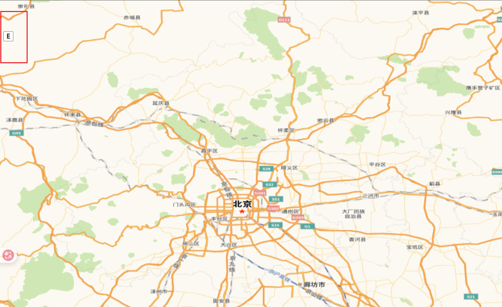

# Controls 对象

Controls 是 OpenLayers 中提供用户交互界面的 UI 组件，用于展示地图信息和操作地图功能。

## 控件类型一览

| 控件类型          | 引入路径                   | 功能描述         | 默认启用 |
| ----------------- | -------------------------- | ---------------- | -------- |
| **Zoom**          | `ol/control/Zoom`          | 缩放按钮 (+/-)   | ✔️       |
| **Rotate**        | `ol/control/Rotate`        | 旋转复位按钮     | ✔️       |
| **Attribution**   | `ol/control/Attribution`   | 版权信息展示     | ✔️       |
| **FullScreen**    | `ol/control/FullScreen`    | 全屏切换按钮     | ❌       |
| **ScaleLine**     | `ol/control/ScaleLine`     | 比例尺指示器     | ❌       |
| **MousePosition** | `ol/control/MousePosition` | 鼠标坐标显示     | ❌       |
| **OverviewMap**   | `ol/control/OverviewMap`   | 鹰眼图（小地图） | ❌       |
| **ZoomSlider**    | `ol/control/ZoomSlider`    | 缩放滑块         | ❌       |
| **ZoomToExtent**  | `ol/control/ZoomToExtent`  | 区域定位按钮     | ❌       |

### 默认控件集合

在`ol/control/defaults`类中定义了默认控件集合。

- `attribution`：包含 Attribution 控件，默认为 true
- `attributionOptions`：Attribution 控件的选项，默认 undefined
- `rotate`：包含 Rotate 控件，默认为 true
- `rotateOptions`：Rotate 控件的选项，默认 undefined
- `zoom`：包含 Zoom 控件，默认为 true
- `zoomOptions`：Zoom 控件的选项，默认 undefined

禁用所有默认控件

```js
import { defaults } from "ol/control/defaults";

new Map({
  controls: defaults({
    attribution: false,
    rotate: false,
    zoom: false,
  }),
});
```

### Zoom - 缩放控件

接下来每个控件在代码注释中写明所有配置项

```js
import Zoom from "ol/control/Zoom.js";

new Zoom({
  duration: 250, // 默认值为 250,动画持续时间（毫秒）
  className: "ol-zoom", // 默认为 'ol-zoom',自定义CSS类
  zoomInClassName: "ol-zoom-in", // 默认为 className + '-in',放大按钮的自定义CSS类
  zoomOutClassName: "ol-zoom-out", // 默认为 className + '-out',缩小按钮的自定义CSS类
  zoomInLabel: "+", // 默认为'+',放大按钮文本,可以为HTMLElement元素
  zoomOutLabel: "-", // 默认为 '–',缩小按钮文本,可以为HTMLElement元素
  zoomInTipLabel: "Zoom in", // 默认为 'Zoom in',按钮提示的文本标签
  zoomOutTipLabel: "Zoom out", // 默认为 'Zoom out',按钮提示的文本标签
  delta: 1, // 默认值为 1,每次点击的缩放变化值
  target: HTMLElement | string | undefined, //控件在地图视口之外渲染的HTMLElement元素
});
```



### Rotate - 旋转控件

```js
import Rotate from "ol/control/Rotate.js";

new Rotate({
  duration: 250, // 默认值为 250,动画持续时间（毫秒）
  className: "ol-rotate", // 默认值为'ol-rotate',自定义CSS类
  compassClassName: "ol-compass", // 默认为 'ol-compass',指南针的 CSS 类名
  tipLabel: "Reset rotation", // 默认为 'Reset rotation',旋转提示的文本标签
  label: "⇧", // 默认为 '⇧',旋转按钮的文本标签
  autoHide: true, // 默认为 true,角度为0时是否隐藏
  resetNorth: "function" | undefined, // 控件被点击时调用的函数
  target: HTMLElement | string | undefined, //控件在地图视口之外渲染的HTMLElement元素
});
```

按住 alt+shift+左键旋转地图，出现`复位按钮`，点击复位按钮可以将地图旋转角度重置为 0。



### FullScreen - 全屏控件

```js
import FullScreen from "ol/control/FullScreen";

new FullScreen({
  className: "ol-full-screen", // 默认为 'ol-full-screen',自定义CSS类
  label: "\u2922", // 默认为 '\u2922',按钮的文本标签,可以为HTMLElement元素
  labelActive: "\u00d7", // 默认为 '\u00d7',全屏激活时按钮的文本标签,可以为HTMLElement元素
  tipLabel: "Toggle full-screen", // 默认为'Toggle full-screen',按钮提示的文本标签
  keys: false, // 默认为 false,是否允许使用键盘快捷键
  activeClassName: "ol-full-screen-true", //默认为 className + '-true,全屏激活时按钮的 CSS 类名
  inactiveClassName: "ol-full-screen-false", //默认为 className + '-false,全屏激活时按钮的 CSS 类名
  target: HTMLElement | string | undefined, //控件在地图视口之外渲染的HTMLElement元素
  source: HTMLElement | string | undefined, //用于全屏显示的元素。如果未提供，将全屏显示包含地图视口的元素
});
```



### Attribution - 版权信息控件

```js
import Attribution from "ol/control/Attribution.js";

new Attribution({
  className: "ol-attribution", // 默认为 'ol-attribution',自定义CSS类
  collapsible: boolean | undefined, // 指定归属信息是否可以折叠
  collapsed: true, // 默认为 true,初始是否折叠
  tipLabel: "Attributions", // 默认为 'Attributions',用于按钮提示的文本标签
  label: "i", // 默认为 'i',折叠按钮的文本标签
  collapseLabel: "›", // 默认为 '›',展开按钮的文本标签
  target: HTMLElement | string | undefined, //控件在地图视口之外渲染的HTMLElement元素
  attributions: "@xxxxx版权信息", // 可选的归属信息
});
```



### ScaleLine - 比例尺控件

```js
import ScaleLine from "ol/control/ScaleLine.js";

new ScaleLine({
  className: "ol-scale-line", // 默认为 'ol-scale-line',自定义CSS类
  minWidth: 64, // 默认为 64,比例尺最小宽度（像素）
  maxWidth: number | undefined, // 最大像素宽度
  // metric：千米
  // us：美制
  // imperial：英制
  // degrees：度
  // nautical：海里
  units: "metric", // 默认为 'metric',可选 'degrees', 'imperial', 'us', 'nautical'
  bar: false, // 默认为 false,是否显示条形比例尺
  steps: 4, // 默认为 4,条形比例尺的分段数
  text: false, // 默认为 false,是否显示文本
  target: HTMLElement | string | undefined, //控件在地图视口之外渲染的HTMLElement元素
});
```


### MousePosition - 鼠标位置控件

```js
import MousePosition from "ol/control/MousePosition.js";

new MousePosition({
  className: "ol-mouse-position", // 默认为 'ol-mouse-position',自定义CSS类
  coordinateFormat: undefined, // 坐标格式化函数
  projection: "EPSG:4326", // 默认是视图投影
  target: HTMLElement | string | undefined, //控件在地图视口之外渲染的HTMLElement元素
});
```



### OverviewMap - 概览图控件

```js
import OverviewMap from "ol/control/OverviewMap.js";

new OverviewMap({
  className: "ol-overviewmap", // 默认为 'ol-overviewmap',自定义CSS类
  collapsed: true, // 默认为 true,初始是否折叠
  collapsible: true, // 默认为 true,是否可折叠
  label: "›", // 默认为 '›',折叠按钮的文本标签
  collapseLabel: "‹", // 默认为'‹',展开按钮的文本标签
  tipLabel: "Overview map", // 默认为 'Overview map',按钮提示的文本标签
  layers: [], // 概览图中的图层集合
  rotateWithView: false, // 默认为 false,控件视图是否应与主地图视图一起旋
  target: HTMLElement | string | undefined, //控件在地图视口之外渲染的HTMLElement元素
});
```



### ZoomSlider - 滑动缩放控件

```js
import ZoomSlider from "ol/control/ZoomSlider.js";

new ZoomSlider({
  className: "ol-zoomslider", // 默认为 'ol-zoomslider',自定义CSS类
  duration: 200, // 默认为 200,动画持续时间（毫秒）
  target: HTMLElement | string | undefined, //控件在地图视口之外渲染的HTMLElement元素
});
```



### ZoomToExtent - 缩放到范围控件

一个按钮控件，当按下时，会将地图视图切换到特定范围

```js
import ZoomToExtent from "ol/control/ZoomToExtent.js";

new ZoomToExtent({
  className: "ol-zoom-extent", // 默认为 'ol-zoom-extent',自定义CSS类
  label: "E", // 默认为 'E',按钮的文本标签
  tipLabel: "Zoom to extent", // 默认为 'Zoom to extent',按钮提示的文本标签
  extent: [minX, minY, maxX, maxY], // 指定缩放到的范围
  target: HTMLElement | string | undefined, //控件在地图视口之外渲染的HTMLElement元素
});
```



## 禁用默认控件

`new Map({ controls: [] })`禁用默认控件

```js
new Map({
  controls: [],
  // 其他配置...
});
```

## 控件管理方法

```js
// 添加控件
map.addControl(scaleLineControl);

// 移除控件
map.removeControl(fullScreenControl);

// 获取所有控件
const controls = map.getControls();

// 查找特定控件
const zoomControl = map
  .getControls()
  .array_.find((ctrl) => ctrl instanceof Zoom);
```
