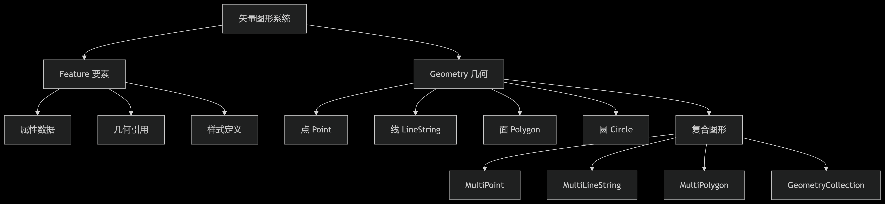

# 矢量图形

OpenLayers 中的矢量图形，Feature（要素）和 Geometry（几何）类构成了矢量图形系统的基础



## Geometry 类详解

Geometry 类表示地理空间中的形状，是所有几何图形的基类。

### 类型一览

| 几何类型           | 描述                | 创建示例                               |
| ------------------ | ------------------- | -------------------------------------- |
| Point              | 单点位置            | new Point([x, y])                      |
| LineString         | 线（有序点序列）    | new LineString([[x1,y1], [x2,y2]])     |
| Polygon            | 多边形（外环+内环） | new Polygon([[[x1,y1], [x2,y2], ...]]) |
| Circle             | 圆形                | new Circle(center, radius)             |
| MultiPoint         | 多点集合            | new MultiPoint([[x1,y1], [x2,y2]])     |
| MultiLineString    | 多线集合            | new MultiLineString([[...], [...]])    |
| MultiPolygon       | 多面集合            | new MultiPolygon([[...], [...]])       |
| GeometryCollection | 混合几何集合        | new GeometryCollection([point, line])  |

### 公共方法

所有几何类型都继承自 ol/geom/Geometry 基类，具有以下公共方法

| 方法                             | 描述                 | 参数                        |
| -------------------------------- | -------------------- | --------------------------- |
| clone()                          | 创建几何的深拷贝     | -                           |
| getExtent()                      | 获取空间范围         | extent(可选)                |
| getType()                        | 获取几何类型         | -                           |
| transform(source, destination)   | 转换坐标系           | sourceProj, destProj        |
| applyTransform(transformFn)      | 应用自定义坐标变换   | transformFn                 |
| simplify(tolerance)              | 简化几何             | tolerance                   |
| rotate(angle, anchor)            | 旋转几何             | angle(弧度), anchor(中心点) |
| scale(factorX, factorY, anchor)  | 缩放几何             | factorX, factorY, anchor    |
| translate(deltaX, deltaY)        | 平移几何             | deltaX, deltaY              |
| intersectsCoordinate(coordinate) | 判断坐标是否在几何内 | [x, y]                      |
| intersectsExtent(extent)         | 判断是否与范围相交   | [minX, minY, maxX, maxY]    |
| getCoordinates()                 | 获取坐标             | -                           |
| setCoordinates(coordinates)      | 设置坐标             | 坐标数组                    |

### 点（Point）

点几何表示地球上的一个单一位置。

```js
import Point from "ol/geom/Point";

const point = new Point([116.4074, 39.9042]);
point.getCoordinates(); // [116.4074, 39.9042]

point.transform("EPSG:4326", "EPSG:3857"); // [12245410.74511129, 3844357.763493687]
```

### 线（LineString）

线几何表示由有序点序列组成的路径。

特有方法：

- getLength()：返回线要素在投影平面上的长度
- getCoordinateAt(fraction)：根据参数 fraction（取值范围 0 到 1）返回线要素上的坐标
- forEachSegment(callback)：遍历线要素的每个线段，对每个线段执行回调函数
  - callback：对每个线段执行的回调函数，参数为 (start, end)，start 和 end 分别为线段的起始点和结束点坐标

```js
import LineString from "ol/geom/LineString";

const line = new LineString([
  [0, 0],
  [10, 10],
]);
line.getLength(); // 14.142135623730951
line.getCoordinateAt(0.5); // [5, 5]
```

### 面（Polygon）

面几何表示由有序点序列组成的闭合区域。

特有方法：

- getArea()：返回面要素在投影平面上的面积
- getInteriorPoint()：返回面要素内部的一个点

```js
import Polygon from "ol/geom/Polygon";

const polygon = new Polygon([
  [
    [0, 0],
    [10, 0],
    [10, 10],
    [0, 10],
    [0, 0],
  ],
]);
polygon.getArea(); // 100
polygon.getInteriorPoint().getCoordinates(); // [5, 5, 10]
```

### 圆（Circle）

圆形几何，Circle 类表示一个圆形区域。

new Circle(center, radius)

- center：圆的中心点坐标，格式为 [x, y]
- radius：圆的半径，单位与地图投影单位相同

特有方法：

- getRadius()：返回圆要素的半径
- getCenter()：返回圆要素的中心点
- setRadius(radius)：设置圆要素的半径
- setCenter(center)：设置圆要素的中心点
- setCenterAndRadius(center, radius)：同时设置中心点和半径

```js
import Circle from "ol/geom/Circle";

const circle = new Circle([0, 0], 5);

circle.getRadius();

circle.getCenter();

circle.setRadius(10);

circle.setCenter([1, 1]);

circle.setCenterAndRadius([2, 2], 15);
```

### 多点（MultiPoint）

MultiPoint 类表示多个点的集合。

特有方法：

- getPoints()：返回多点要素的点数组
- getPoint(index)：返回指定索引的点
- appendPoint(point)：添加一个点到多点要素中

```js
import MultiPoint from "ol/geom/MultiPoint";

const multiPoint = new MultiPoint([
  [0, 0],
  [10, 10],
]);

multiPoint.getPoints(); // [Point, Point]

multiPoint.getPoint(0); // Point

multiPoint.appendPoint(new Point([20, 20]));
```

### 多线（MultiLineString）

MultiLineString 类表示多个线的集合。

特有方法：

- getLineStrings()：返回多线要素的线数组
- getLineString(index)：返回指定索引的线
- appendLineString(lineString)：添加一条线到多线要素中
- getLength()：返回多线要素的总长度

```js
import MultiLineString from "ol/geom/MultiLineString";

const multiLine = new MultiLineString([
  [
    [0, 0],
    [10, 10],
  ],
  [
    [20, 20],
    [30, 30],
  ],
]);

multiLine.getLineStrings(); // [LineString, LineString]

multiLine.getLineString(0); // LineString

multiLine.appendLineString(
  new LineString([
    [40, 40],
    [50, 50],
  ])
);
```

### 多面（MultiPolygon）

MultiPolygon 类表示多个面的集合。

特有方法：

- getPolygons()：返回多面要素的面数组
- getPolygon(index)：返回指定索引的面
- appendPolygon(polygon)：添加一个面到多面要素中
- getArea()：返回多面要素的总面积

```js
import MultiPolygon from "ol/geom/MultiPolygon";

const multiPoly = new MultiPolygon([
  [
    [
      [0, 0],
      [10, 0],
      [10, 10],
      [0, 10],
      [0, 0],
    ],
  ],
  [
    [
      [20, 20],
      [30, 20],
      [30, 30],
      [20, 30],
      [20, 20],
    ],
  ],
]);
multiPoly.getArea(); // 200
multiPoly.appendPolygon(
  new Polygon([
    [
      [5, 5],
      [15, 5],
      [15, 15],
      [5, 15],
      [5, 5],
    ],
  ])
);
```

### 集合（GeometryCollection）

GeometryCollection 类表示多个几何要素的集合。

特有方法：

- getGeometries()：返回集合中的几何要素数组
- setGeometries(geometries)：设置集合中的几何要素数组
- getExtent()：返回集合中所有几何要素的范围

```js
import GeometryCollection from "ol/geom/GeometryCollection";

const collection = new GeometryCollection([
  new Point([0, 0]),
  new LineString([
    [0, 0],
    [10, 10],
  ]),
]);
collection.getGeometries().length; // 2
```

## Feature 类详解

在 OpenLayers 中，一个 Feature 对象就表示一个地理要素。

**核心概念**

- Feature = Geometry + Attributes + Style
- 每个 Feature 代表地图上的独立实体（如建筑物、道路）
- 通过 Vector Layer 渲染到地图

### 属性

- 直接传递一个 Geometry 对象，或者传入一个对象，存在`geometry`键，Geometry 会和这个键相关联

```js
// 示例1：直接传入一个 Geometry 对象
const feature = new Feature(new Point([116.4074, 39.9042]));

// 示例2：传入一个对象，存在 geometry 键，Geometry 会和这个键相关联
const feature = new Feature({
  geometry: new Point([0, 0]),
  name: "YGYong",
});
```

### 方法

- `getGeometry()`：获取要素的几何对象
- `setGeometry(geometry)`：设置要素的几何对象
- `get(key)`：获取要素的属性值
- `set(key, value)`：设置要素的属性值
- `getProperties()`：获取要素的所有属性
- `setProperties(properties)`：设置要素的所有属性
- `getGeometryName()`：获取要素的几何类型名称
- `setGeometryName(name)`：设置要素的几何类型名称
- `getKeys()`：获取要素的所有属性键
- `getStyle()`：获取要素的样式
- `setStyle(style)`：设置要素的样式
- `getId()`：获取要素的唯一标识符
- `setId(id)`：设置要素的唯一标识符，要素 ID 可以与 getFeatureById 方法一起使用

```js
// 创建要素
const feature = new Feature({
  geometry: new Point([0, 0]),
  name: "YGYong",
});

// 获取name属性
const name = feature.get("name");
```

```js
// 设置ID
feature.setId("feature_001");

// 获取ID
const featureId = feature.getId();

// 通过source获取ID
const featureById = source.getFeatureById("feature_001");
```

```js
// 设置几何
feature.setGeometry(new Point([10, 20]));

// 获取几何
const geom = feature.getGeometry();
```

```js
// 设置属性集合
feature.setProperties({
  name: "重要设施",
  type: "医院",
  capacity: 500,
  contact: {
    phone: "123-456-7890",
    email: "contact@example.com",
  },
});

// 获取属性集合
const properties = feature.getProperties();
```

```js
// 设置固定样式
feature.setStyle(
  new Style({
    image: new CircleStyle({
      radius: 10,
      fill: new Fill({ color: "red" }),
    }),
  })
);

// 设置动态样式函数
feature.setStyle((feature, resolution) => {
  const size = resolution < 100 ? 10 : 5;
  return new Style({
    image: new CircleStyle({
      radius: size,
      fill: new Fill({ color: "blue" }),
    }),
  });
});
```
